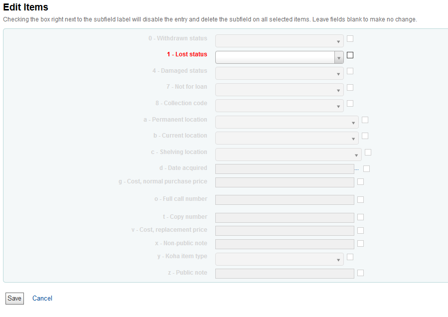

This project disables all batch modification fields except 'Lost' so that users with the batchmod permission may only use it to modify the lost status. The code uses an array to remove that restriction for select users.
## Screenshot of locked down tool


## JS Breakdown

### Capture logged in users
```js
var loggedUser = $("#logged-in-info-full .loggedinusername").text();
```

### Designate users who can have full access
```js
var fullBatchers = ["Kim", "Melissa", "Jason"]; //Disable the blocks for these users
```

### Check to see if the logged user is allowed full access, and make sure the code only affects the batchMod-edit page
```js
if (($.inArray(loggedUser, fullBatchers) == -1) && ($('body').is('#tools_batchMod-edit'))) {	
		//Do stuff
    }
```

### Modifications to the batchmod form
```js
//disable checboxes
$("#row9520, #row9522, #row9523, #row9524, #row9525, #row9527, #row9528, #row952a, #row952b, #row952c, #row952d, #row952e, #row952f, #row952g, #row952h, #row952j, #row952o, #row952t, #row952u, #row952v, #row952w, #row952x, #row952y, #row952z").prop("disabled", true);

//hide certain form fields entirely
$("#error2, #error3, #error5, #error12, #error13, #error15,  #error16, #error25, #error27").parent().parent().parent().hide();

//color 'lost' field label red to emphasize
$("#error1").css("color", "red");
$('label[for*="tag_952_subfield_1_"]').css('color', 'red');

//color all other field labels light gray to demphasize
$("#error0, #error2, #error3, #error4, #error5, #error6, #error7, #error8, #error9, #error10, #error11, #error12, #error13, #error14, #error15, #error16, #error17, #error18, #error19, #error20, #error21, #error22, #error23, #error24, #error25, #error26, #error27, #error28, #error29, #error30 ").css("color", "lightgray");
$('label[for*="tag_952_subfield_0_"], label[for*="tag_952_subfield_0_"], label[for*="tag_952_subfield_0_"], label[for*="tag_952_subfield_0_"], label[for*="tag_952_subfield_0_"], label[for*="tag_952_subfield_2_"], label[for*="tag_952_subfield_3_"], label[for*="tag_952_subfield_4_"], label[for*="tag_952_subfield_5_"], label[for*="tag_952_subfield_6_"], label[for*="tag_952_subfield_7_"], label[for*="tag_952_subfield_8_"], label[for*="tag_952_subfield_a_"], label[for*="tag_952_subfield_b_"], label[for*="tag_952_subfield_c_"], label[for*="tag_952_subfield_d_"], label[for*="tag_952_subfield_e_"], label[for*="tag_952_subfield_f_"], label[for*="tag_952_subfield_g_"], label[for*="tag_952_subfield_h_"], label[for*="tag_952_subfield_j_"], label[for*="tag_952_subfield_o_"], label[for*="tag_952_subfield_t_"], label[for*="tag_952_subfield_u_"], label[for*="tag_952_subfield_v_"], label[for*="tag_952_subfield_w_"], label[for*="tag_952_subfield_x_"], label[for*="tag_952_subfield_y_"], label[for*="tag_952_subfield_z_"]').css('color', 'lightgray');

//disable visible form fields
$('[id*="tag_952_subfield_0_"], [id*="tag_952_subfield_0_"], [id*="tag_952_subfield_0_"], [id*="tag_952_subfield_0_"], [id*="tag_952_subfield_0_"], [id*="tag_952_subfield_2_"], [id*="tag_952_subfield_3_"], [id*="tag_952_subfield_4_"], [id*="tag_952_subfield_5_"], [id*="tag_952_subfield_6_"], [id*="tag_952_subfield_7_"], [id*="tag_952_subfield_8_"], [id*="tag_952_subfield_a_"], [id*="tag_952_subfield_b_"], [id*="tag_952_subfield_c_"], [id*="tag_952_subfield_d_"], [id*="tag_952_subfield_e_"], [id*="tag_952_subfield_f_"], [id*="tag_952_subfield_g_"], [id*="tag_952_subfield_h_"], [id*="tag_952_subfield_j_"], [id*="tag_952_subfield_o_"], [id*="tag_952_subfield_t_"], [id*="tag_952_subfield_u_"], [id*="tag_952_subfield_v_"], [id*="tag_952_subfield_w_"], [id*="tag_952_subfield_x_"], [id*="tag_952_subfield_y_"], [id*="tag_952_subfield_z_"]').prop('disabled', true);
```


## Complete JS
```js
//Batch Item Modification Lockdown
$(document).ready(function() {
    var loggedUser = $("#logged-in-info-full .loggedinusername").text();
    var fullBatchers = ["Kim", "Melissa", "aprilr", "lwalther", "awakenedvc", "jrobb"]; //Disable the blocks for these users
    if (($.inArray(loggedUser, fullBatchers) == -1) && ($('body').is('#tools_batchMod-edit'))) {
        $("#row9520, #row9522, #row9523, #row9524, #row9525, #row9527, #row9528, #row952a, #row952b, #row952c, #row952d, #row952e, #row952f, #row952g, #row952h, #row952j, #row952o, #row952t, #row952u, #row952v, #row952w, #row952x, #row952y, #row952z").prop("disabled", true);
        $("#error2, #error3, #error5, #error12, #error13, #error15,  #error16, #error25, #error27").parent().parent().parent().hide();
        $("#error1").css("color", "red");
        $("#error0, #error2, #error3, #error4, #error5, #error6, #error7, #error8, #error9, #error10, #error11, #error12, #error13, #error14, #error15, #error16, #error17, #error18, #error19, #error20, #error21, #error22, #error23, #error24, #error25, #error26, #error27, #error28, #error29, #error30 ").css("color", "lightgray");
        $('[id*="tag_952_subfield_0_"], [id*="tag_952_subfield_0_"], [id*="tag_952_subfield_0_"], [id*="tag_952_subfield_0_"], [id*="tag_952_subfield_0_"], [id*="tag_952_subfield_2_"], [id*="tag_952_subfield_3_"], [id*="tag_952_subfield_4_"], [id*="tag_952_subfield_5_"], [id*="tag_952_subfield_6_"], [id*="tag_952_subfield_7_"], [id*="tag_952_subfield_8_"], [id*="tag_952_subfield_a_"], [id*="tag_952_subfield_b_"], [id*="tag_952_subfield_c_"], [id*="tag_952_subfield_d_"], [id*="tag_952_subfield_e_"], [id*="tag_952_subfield_f_"], [id*="tag_952_subfield_g_"], [id*="tag_952_subfield_h_"], [id*="tag_952_subfield_j_"], [id*="tag_952_subfield_o_"], [id*="tag_952_subfield_t_"], [id*="tag_952_subfield_u_"], [id*="tag_952_subfield_v_"], [id*="tag_952_subfield_w_"], [id*="tag_952_subfield_x_"], [id*="tag_952_subfield_y_"], [id*="tag_952_subfield_z_"]').prop('disabled', true);
        $('label[for*="tag_952_subfield_1_"]').css('color', 'red');
        $('label[for*="tag_952_subfield_0_"], label[for*="tag_952_subfield_0_"], label[for*="tag_952_subfield_0_"], label[for*="tag_952_subfield_0_"], label[for*="tag_952_subfield_0_"], label[for*="tag_952_subfield_2_"], label[for*="tag_952_subfield_3_"], label[for*="tag_952_subfield_4_"], label[for*="tag_952_subfield_5_"], label[for*="tag_952_subfield_6_"], label[for*="tag_952_subfield_7_"], label[for*="tag_952_subfield_8_"], label[for*="tag_952_subfield_a_"], label[for*="tag_952_subfield_b_"], label[for*="tag_952_subfield_c_"], label[for*="tag_952_subfield_d_"], label[for*="tag_952_subfield_e_"], label[for*="tag_952_subfield_f_"], label[for*="tag_952_subfield_g_"], label[for*="tag_952_subfield_h_"], label[for*="tag_952_subfield_j_"], label[for*="tag_952_subfield_o_"], label[for*="tag_952_subfield_t_"], label[for*="tag_952_subfield_u_"], label[for*="tag_952_subfield_v_"], label[for*="tag_952_subfield_w_"], label[for*="tag_952_subfield_x_"], label[for*="tag_952_subfield_y_"], label[for*="tag_952_subfield_z_"]').css('color', 'lightgray');
    }
});
```