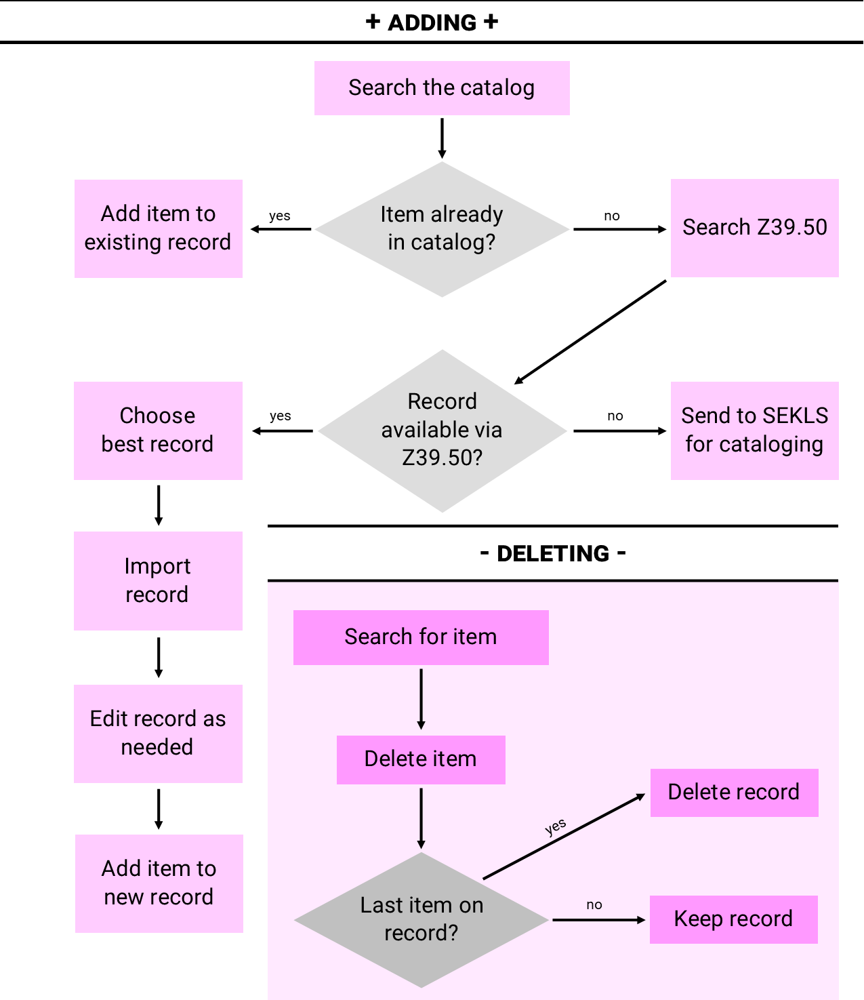
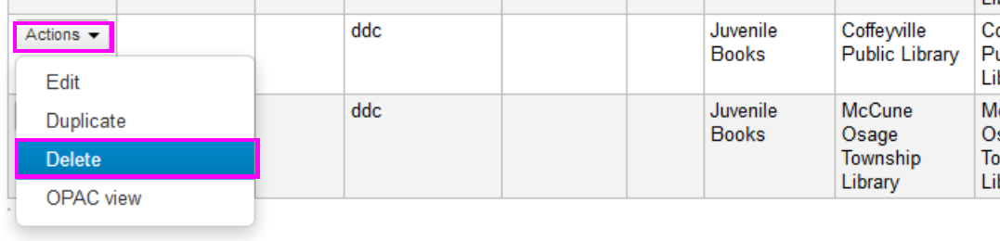

## Workflow

## Searching

### Finding an existing record
Start your search with the **Search the catalog** tab of the main search bard.

Keyword searches scan the entire record; start with a **Keyword** search on **ISBN**.

*Don't give up after one search!* Try different search terms and filters.
Title & Author

Title with the *Title* filter selected

Use *Advanced search* for a Title & Author or Title & Actor search

	
> #### SEKnFind search tips
> - Check spelling and punctuation
> - Try variations:
> 	- season 1 = season one = first season
> 	- sorcerer's = sorcerers = sorcerer s
> - Try fewer words in long titles
> - Add articles (a, an, the) for shorter titles
> - Use author/actor names with short titles
> - Use common keywords like DVD, Blu-ray, videodisc, sound recording

## Matching
The item your cataloging must match the record you're adding it to.

When comparing results to the item in hand, pay attention to:
> 1. Title
> 2. Author
> 3. Publisher
> 4. Paging / Size / Number of discs
> 5. ISBNs
> 6. Copyright date

## Adding items
When you find a record that matches your item, add your item.

1. Click **New** then **New item**

2. Fill in the required fields

3. Click **Add item**

## Adding records
When you are unable to find a record that matches your item, you should attempt to find a record via Z39.50. If no records are available there, contact the SEKLS cataloging department for assistance.

### Z39.50 record import
1. From the search results screen, click **Z39.50/SRU search**

2. In the window that pops up, enter your search term(s)

	> #### Z39.50 search tips
	> - Try ISBN alone
	> - Try Title + Author/Actor
	> - Try UPCs and other numbers in the 'Keyword' or 'Standard ID' fields
	> - Add *videodisc* or *dvd* or *videorecording* or *blu* in the keyword field for movies
	> - Pre-checked targets are faster, but you can also try unchecked targets for more results
	> - Check your spelling and punctuation
3. Pick the best record.
	- Review title, author, publication date, ISBN and description.
	- You can click the **Card** link for more details, and **MARC** for full details.
	
4. Import the chosen record by clicking **Import**

5. Add an itemtype in the **942$c** -- the record won't save without one.

> #### Avoid duplicates
> 
> If you see this box appear, make sure the existing record won't work for your item by click on the linked title.
>
> If the record matches, add your item to it. If not, return to the yellow box and choose **No, save as new record**.

### Adding records from SHAREit

#### Grab records from SHAREit
1. Log in to SHAREit.

2. Create a list.

3. Search and add records to the list.

4. Download the list.

#### Upload records to Koha
1. Click **More**, **Tools**, **Stage MARC records for import**

2. Browse to your .mrc file or drag it from your downloads folder to the browse button

3. Click **Upload**
4. Match these settings

5. Click **Stage for import**

#### Import records
1. Click **Manage staged records** button.

2. Click **Import this batch into the catalog** button.

3. Wait.

4. A completion message and links to your new records will appear once the import is complete.

## MARC reference
Most records will use these fields and subfields:
|    Field            |    Subfield(s)    |    What’s it for?                                   |    Which records need it?    |
|---------------------|-------------------|-----------------------------------------------------|------------------------------|
|    020              |    a              |    ISBN                                             |    Most                      |
|    100              |    a              |    Author                                           |    Most                      |
|    245              |    a, b           |    Title, subtitle                                  |    All                       |
|    246              |    a              |    Other title                                      |    Some                      |
|    250              |    a              |    Edition statement                                |    Some                      |
|    260 or 264       |    a, b, c        |    Publisher info                                   |    All                       |
|    300              |    a, b, c        |    Paging, size, etc.                               |    All                       |
|    336, 337, 338    |                   |    RDA identifiers                                  |    Most                      |
|    440/490          |    a, v           |    Series info                                      |    Some                      |
|    5XX              |                   |    Notes                                            |    Some                      |
|    6XX              |                   |    Subjects                                         |    Most                      |
|    7XX              |                   |    Additional authors, actors, illustrator, etc.    |    Some                      |
|    942              |    c              |    Item type                                        |    All                       |
|    942              |    n              |    OPAC suppression                                 |    Some                      |

Example record:
|    Field            |    Subfield    |    Used for                                         |    Example                    |
|---------------------|----------------|-----------------------------------------------------|-------------------------------|
|    000 (Leader)     |    pos 06      |    Encodes item format                              |    a                          |
|    000 (Leader)     |    pos 18      |    Encodes cataloging type                          |    i for RDA, a for AACR2     |
|    020              |    a           |    ISBN                                             |    0399157336                 |
|    100              |    a           |    Author                                           |    Coulter, Catherine         |
|    245              |    a           |    Title                                            |    Bombshell /                |
|    246              |    a           |    Other title                                      |    Bomb shell                 |
|    250              |    a           |    Edition statement                                |    1st edition.               |
|    264              |    a           |    Publisher - Place                                |    New York :                 |
|    264              |    b           |    Publisher - Name                                 |    G.P. Putnam's Sons         |
|    264              |    c           |    Publisher - Date                                 |    2013.                      |
|    300              |    a           |    Description - Extent                             |    392 pages ;                |
|    300              |    c           |    Description - Dimensions                         |    24 cm.                     |
|    336, 337, 338    |                |    RDA identifiers                                  |                               |
|    490              |    a           |    Series - Title                                   |    FBI series ;               |
|    490              |    v           |    Series - Volume                                  |    bk. 17                     |
|    5XX              |                |    Notes                                            |                               |
|    6XX              |                |    Subjects                                         |    Murder -- Investigation    |
|    7XX              |                |    Additional authors, actors, illustrator, etc.    |    Coulter, Allen             |
|    942              |    c           |    Item type                                        |    Book                       |

## Deleting

### Deleting single items
1. Click **Edit** then **Edit items**

2. Find your item in the table, click **Actions** then **Delete**

### Deleting multiple items
1. Click **More**, **Tools**, **Batch item deletion**

2. Scan the barcode of each item into the **barcode list** box, then click **Continue**

3. **Uncheck** any items you wish to keep

4. Click **Delete selected items**.

### Deleting empty records
1. Click **Edit**, then **Delete record**

2. Click **OK**

