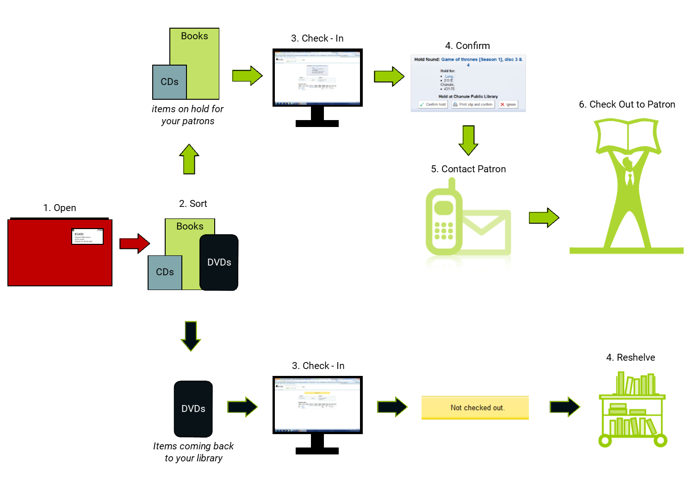
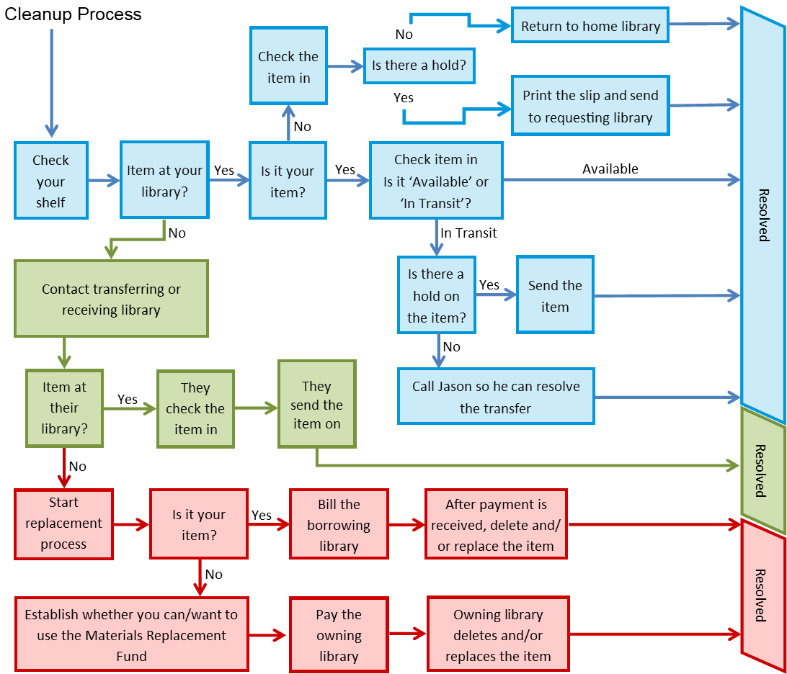

# Circulation
[***View the latest version of this documentation with screenshots in Google Drive***](https://docs.google.com/document/d/1kypYylxi9GYCUyD9yFhLvQsXW-DPXE3dufCfhkoA2fQ/edit?usp=sharing)
## Circulation basics
### Checking in
1. Click **Check in** on the header search and scan your first barcode.
2. Continue to **scan and watch** the screen! Your scanned items appear in the table below the check in box.
3. Watch for messages and follow prompts.

> ***Reminders***
> - Checking in updates some item statuses and refreshes the last seen date.
> - Always check in items returned by patrons and via the courier.
> - Always check in items to trigger holds.

### Checking out
1. Choose **Check out** on the header search and scan the patron’s card or start typing the patron’s name.
2. **Verify** you have the correct account.
    _Check the upper left area of the patron account to quickly see identifiable information including:_
    - _Name_
    - _Card number_
    - _Address_
    - _Phone number_
    - _Email_
    - _Birth date_
    - _Current home library_
3. **Scan** each item’s barcode into the checkout box; checkouts will appear below.
4. **Print** a due date slip and/or exit the account when finished.

### Searching
- Choose **Search the catalog** on the header search for a quick, basic search.
- The left dropdown can be used to quickly refine your search to a certain field.

#### Search syntax modifiers
- ***Fuzzy (Spellchecker)***
    - **Tilde (~)** - add to the end of each word you want to spellcheck
        - **wierd~** searches for wired, weird
        - **liberry~** searches for library, liberty
        - **midevil~** searches medieval
- ***Wildcards***
    - **Question mark (?)** - stands in for one character
        - **c?t** searches for cat, cot, cut
        - **c?at** searches for chat, coat
    - **Asterisk(\*)**- stands in for 0 or more characters
        - **c\*t** searches for ct, cat, cot, coat, cut, connecticut, court, cormorant, etc.
        - **c\*at** searches for cat, chat, coat, cheat, etc.
        - **cat\*** searches for cat, cats, catapult, catastrophe, caterer, etc.
        - **\*cat** searches for scat, wildcat, bobcat, etc.
- ***Phrases***
    - **Quotation marks (“”)** - surround a phrase to force an exact match
        - **“Pete the cat”** only shows titles that have the exact phrase _Pete the cat_
        - **“The Road”** only shows titles where _the_ is directly left of _road_
- ***Negating terms***
    - **Minus sign (-)** - add to the start of each word you want to remove
        - **cat -dog** searches for titles with cat but not dog
        - **fantasy -romance** searches for fantasy titles without romance in the record

#### Search results
- Results can be refined using the **facets** on the left.
- Results can be sorted using the **Sort** button.
- **Availability** is visible in the right column - local copies are highlighted in green.
- Clicking a **title** opens the record detail view.

## Sharing

### Incoming workflow

### Outgoing workflow

### Placing holds
1. Search for a title.
2. Click **Place hold** from the search results or record details.
    _Search results - checkbox(es) then click **Place hold** button_
    _Record detail - click **Place hold** button_
3. Search for the patron – you can scan their card or start typing their name.
4. Verify hold details.
    - _Make sure the title, patron, and pickup location are correct._
    - _Make sure **Hold next available item** is checked._
    - _Additional options:_
        - _Notes - appear on the holds queue_
        - _Starts on date - to trigger hold in the future_
        - _Expires date - automatically deletes hold after a certain period_
5. Click **Place hold**.

### Pulling holds
1. Click **Circulation** in the top navigation bar.
2. Click **Holds queue**.
3. Click **Submit**.
4. (Optional) **Print** the queue.
5. **Pull** the items listed.
6. **Check in** each item to trigger the hold.
    1. For items going to another library:
        1. Click **Print slip, transfer, and confirm**
        2. Place the slip in the item
        3. Prepare the item for courier pickup
    2. For items getting picked up at your library:
        1. Click **Print slip and confirm**
        2. Place the slip in the item
        4. Notify the patron (if they do not have text or email notification set)

### Statuses
#### Changing an item’s status
1. Click into the record for the item in question.
2. Click the **barcode** of the item you’d like to modify.
3. Determine which status to use (see next page).
4. Choose a status from the appropriate dropdown.
5. Click **Set status**.

#### Circulation-related statuses
<table>
  <tr>
   <td colspan="5" >LOST
   </td>
  </tr>
  <tr>
   <td>
    <strong>Status</strong>
   </td>
   <td><strong>When to use</strong>
   </td>
   <td><strong>Clears on 
check-in</strong>
   </td>
   <td><strong>Holds</strong>
   </td>
   <td><strong>OPAC 
visible</strong>
   </td>
  </tr>
  <tr>
   <td><strong>Missing</strong>
   </td>
   <td>
<ul>

<li>Can’t find item on holds queue
<li>Item is temporarily misplaced but will likely resurface
</li>
</ul>
   </td>
   <td>Yes
   </td>
   <td>No
   </td>
   <td>No
   </td>
  </tr>
  <tr>
   <td><strong>Lost</strong>
   </td>
   <td>
<ul>

<li>Item likely will not resurface

<li>Missing items that are not found after an extended amount of time
</li>
</ul>
   </td>
   <td>Yes
   </td>
   <td>No
   </td>
   <td>No
   </td>
  </tr>
  <tr>
   <td><strong>Long overdue</strong>
   </td>
   <td>
<ul>

<li>Automatic status applied at 99 days overdue
</li>
</ul>
   </td>
   <td>Yes
   </td>
   <td>No
   </td>
   <td>No
   </td>
  </tr>
  <tr>
   <td><strong>Damaged/Lost and charged</strong>
   </td>
   <td>
<ul>

<li>Use to charge a patron the replacement cost of a lost or damaged item
</li>
</ul>
   </td>
   <td>Yes
   </td>
   <td>No
   </td>
   <td>No
   </td>
  </tr>
  <tr>
   <td><strong>Lost and paid for</strong>
   </td>
   <td>
<ul>

<li>Use when a patron or library has reimbursed you for an item and you are awaiting the replacement item
</li>
</ul>
   </td>
   <td>Yes
   </td>
   <td>No
   </td>
   <td>No
   </td>
  </tr>
</table>

<table>
  <tr>
   <td colspan="5" >WITHDRAWN
   </td>
  </tr>
  <tr>
   <td><strong>Status</strong>
   </td>
   <td><strong>When to use</strong>
   </td>
   <td><strong>Clears on 
check-in</strong>
   </td>
   <td><strong>Holds</strong>
   </td>
   <td><strong>OPAC 
visible</strong>
   </td>
  </tr>
  <tr>
   <td><strong>Withdrawn</strong>
   </td>
   <td>
<ul>

<li>Item needs temporarily removed from circulation (i.e. item is awaiting repair, disc is missing)
</li>
</ul>
   </td>
   <td>No
   </td>
   <td>No
   </td>
   <td>Yes
   </td>
  </tr>
</table>

### Frequently asked questions: Holds
- **Q: How long should I search for an item before marking it missing?**
    - One week. If you cannot find the item and other libraries have it, feel free to mark the item **missing** sooner.

- **Q: What should I do if I cannot find the item and there are other copies available on the record?**
    - Mark your copy **Missing** and the hold will roll over to the next library.

- **Q: What should I do if I cannot find the item and mine is the only one on the record?**
    1. Mark the item **Missing**.
    2. Notify the library of the patron.
    3. Have that library remove the hold.

- **Q: What if a hold is placed on a local item that does not circulate in the consortium? (As in devices, special collections, fragile items, etc.)**
    1. Notify the library of the patron.
    2. Let them know that that specific item doesn’t circulate in the consortium.
    3. Have them remove the hold.
    4. Consider adjusting the cataloging to avoid holds in the future.

- **Q: When I check the book in, no hold pops up. What’s going on?!**
    - A number of factors can cause this to happen:
        * Someone from another library has beat you to filling the hold — Check by looking at the holds page on the item record; the details column will have a barcode if the hold is filled
        * The hold has been suspended — Check by looking at the holds page on the item record; the button on the right will say _Unsuspend_.
        * The hold has been set for a date in the future — Check by looking at the holds page on the item record; the date column will show a future date

- **Q: My patron asked for an item 2 weeks ago and it’s still not here, what gives?**
    - Check the item record. Has someone marked it **missing** and forgotten to notify you? Is it still showing _Available_ and untouched? If a hold is more than a week old and not being filled, contact the potential lender to either have them mark their copy **missing**, or get their copy out the door.

### Working with SHAREit items
#### Borrowing
1. Add the temporary record.
    1. Click **SHAREit > Add temporary record**
    2. Enter author/title/format
    3. Click **Save**

2. Add the temporary item.
    * your initials
    * call number from the item
    * a dummy barcode from a barcoded card
    * item type
        * Incoming ILL (usually 3 weeks)
        * Incoming ILL: Shorter Term (usually 1 week, may need set up)
    * owning library
    * Click **Add item**

3. Add your hold.
    1. **Place a hold** on the newly created record
    2. **Check in** via the barcoded card
    3. **Print slip and confirm**

4. **Check out** to the patron when they come to pick It up using the barcoded card.
5. **Check in** using the barcoded card upon return.
6. Delete the item & record.
    1. Click **More** then **Tools**
    2. Click **Batch item deletion**
    3. Scan each card into the **Barcode list box** then click **Continue**
    4. Scroll to the bottom and click **Delete selected items**

#### Lending
1. **Pull** the requested item.
2. **Update** the item in SHAREit.
3. **Check out** the item to your **ILL patron** in Koha.
4. Upon return, **check in** the item in Koha.
5. **Update** the item in SHAREit.

## Cleanup
### Charging for lost/damaged items
1. Pull up the patron’s account.
2. Click the **barcode** of the item in question.
3. Confirm a replacement price is present.
4. Change the lost status to **Damaged/Lost and charged**.

> ***Reminders***
> - This action checks in the item and charges the replacement price.
> - If the item does not belong to you, a notice will appear. The **owning library should be reimbursed at this point** in the process.

### Returning expired holds
1. Go to **Circulation** then **Holds awaiting pickup**.
2. Check the **Holds waiting over…** tab.
3. Pull the items that need returned.
4. Choose the appropriate action for each item.
5. **Check each item in** to trigger any holds; follow any prompts.

### Transfers cleanup
Run [report 2228](https://staff.seknfind.org/cgi-bin/koha/reports/guided_reports.pl?reports=2228&phase=Run%20this%20report) to see all transfers to and from your library.

> ***Additional Steps***
> - Contact <a href="mailto:courier@nekls.org">courier@nekls.org</a> if you suspect the item was lost on the courier.
> - Check your Rotation boxes.
> - Email the SEKnFind list (<a href="mailto:koha-l@sekls.org">koha-l@sekls.org</a>) to check with all libraries in the consortium.

> ***Materials Replacement Fund Info***
> - 8 claims may be made each year with a minimum claim limit of $5.00.
> - Items must be missing for over 2 months, but less than 1 year.
> - Full details and the form available here:<a href="https://www.sekls.org/material-replacement/"> https://www.sekls.org/material-replacement/</a>.

### Replacement responsibility
#### Transfers from your library
- **Your item** is lost in transit to **Library A**. **Library A** is responsible for replacement.
- **Library A’s item** is lost when **you** are returning it to **Library A**. **Your library** is responsible for replacement.
- **Library Z’s item** is lost when **you** are forwarding it to **Library A** for a hold. **Library A** is responsible for replacement.
- **Library A’s item** is lost when **you** are returning it to **Library A** – it made an unexpected stop at **Library Z** before disappearing. **Your library** is responsible for replacement.

#### Transfers to your library
- **Your item** is lost in transit to **your library**. **Library A** is responsible for replacement.
- **Library A’s item** is lost when filling **your hold**. **Your library** is responsible for replacement.
- **Library Z’s item** is lost when **Library A** is forwarding it to you. **Your library** is responsible for replacement.
- **Library A’s item** is lost when they are filling **your hold** after making an unexpected stop at **Library Z**. **Your library** is responsible for replacement.
