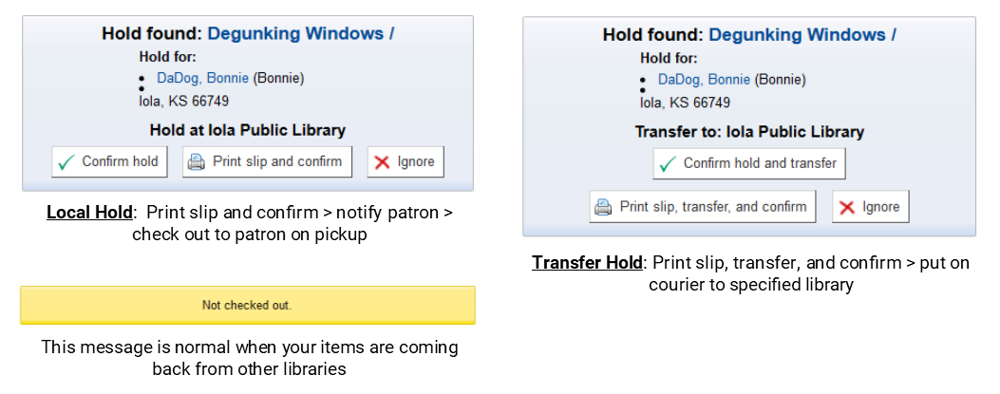

## Workflow

### Incoming Holds and Transfers

### Outgoing Holds and Transfers

## Checking in
1. Choose **Check in** on the header bar and **scan** the barcode

2. **Scan and look!** Your scanned items will appear in the generated table

3. Watch for messages

>***Reminders***
>	- Check in returned items, those coming from the courier, and those going out on the courier
>	- Checking in updates the item status, refreshes the date last seen, puts holds in motion and completes transfers

## Checking out
1. Choose **Check out** on the header bar and **scan** patron's card or search by name

2. **Verify** you have the correct patron

3. **Scan** each barcode into the checkout box; checkouts appear below

4. (Optional) **Print** a due slip

## Placing holds
1. **Search**
	1. Choose **Search the catalog** on the header bar, type your search terms, and submit
	
	2. Click the **title** for the matching record
	3. Verify that you chose the right record; check title, format, etc.
2. **Place hold**
	1. Click **Place hold** button
	
	2. Search for your patron by scanning their card or typing their name
	
	3. Verify **Hold details**
	
	4. Click **Place hold**
	

>***Reminders***
>	- Use the red X to delete a hold
>	- Use the dropdown to change the pickup location
>	- Use the suspend button to pause a hold; add a date to automatically unpause the hold later on

## Pulling holds
1. Click **Circulation** at the top left
	
2. Click **Holds queue** under **Holds**
	
3. Click **Submit**
	
4. Print the holds queue by selecting **File > Print** or pressing **Ctrl+P**
	
5. Pull each item on the queue
	
6. Check in each item you pulled
	
7. For items going to *another* library
	1. Click **Print slip, transfer, and confirm**
		
	2. Place the slip in the item so that it is secure and easy to find
	3. Prepare the item for courier pickup
8. For items for *your* patrons
	1. Click **Print slip and confirm**
		
	2. Place the slip in the item
	3. Notify the patron the item is waiting if they have not already received an email or text.

## Holds FAQ
- **How long should I search for an item before marking it missing?**

	One week. If you cannot find the item and other libraries have it, feel free to mark the item missing sooner to move the hold on faster.
	
- **What should I do if I cannot find the item, and there are other copies available on the record?**

	Mark your copy 'Missing' and the hold will roll over to the next library.
	
- **What should I do if I cannot find the item and mine is the only one on the record?**

	1. Mark the item 'Missing'
	2. Notify the library of the patron
	3. Have that library remove the hold
	
- **What if a hold is placed on a local item that does not circulate in the consortium? (As in devices, special collections, fragile items, ect.)**

	Most items of this nature should be cataloged in a way that disallows holds. If a hold does find its way on this type of item, you should:
	1. Notify the library of the patrons
	2. Let them know that the hold cannot be filled
	3. Have them remove the hold
	4. See if there's a better way to catalog the item to prevent future holds
	
- **When I check the item in, nothing pops up -- what's going on?**

	A number of factors can cause this to occur:
	- Someone from another library beat you to filling the hold -- you can check by looking at the item record to see if a copy is already in transit to fill the hold
	- The hold has been suspended -- check by looking at the holds page for that item; the button on the far right will say 'Unsuspend'
	- The hold is set for a future date -- check by looking at the holds page for the item; the date column will show a date in the future
	
- **My patron asked for an item 2 weeks ago and it's still not here -- what's going on?**

	Many factors can affect the speed a hold is filled, including the number of holds on the record and the number of copies available. Check the item record to see
	the status of the hold:
	- If the item is listed as available, contact the library to see what the holdup is
	- If the item is marked missing but you weren't notified, go ahead and delete the hold and look elsewhere
	- If the hold has become item specific and more copies are available, delete and replace the hold
	
## Item statuses
1. Access the status screen by clicking the **barcode** of the item
	
2. For lost or missing items:
	1. Choose a status from the dropdown
	
		
		
	2. Click **Set status**
	
		
3. For items needed temporarily withdrawn:
	1. Choose *Withdrawn* from the withdrawn status dropdown:
	
	
	2. Click **Set status**
	
	
	
	### Lost statuses
	
	| Status            | When to use                                                                                                   | Clears on check-in? | Holds allowed? | OPAC Visible? |
	|-------------------|---------------------------------------------------------------------------------------------------------------|---------------------|----------------|---------------|
	|Claims returned    |*Do not use at this time*                                                                                      |Yes                  |No              |No             |
	|Missing            |Use for items that are temporarily misplace; items that cannot be found on the holds queue                     |Yes                  |No              |No             |
	|Long Overdue (Lost)|Automatically applied at 99 days overdue                                                                       |Yes                  |No              |No             |
	|Lost               |Use for items that are unlikely to be found: items not seen during inventory, or missing for an extened period |Yes                  |No              |No             |
	|Lost and Paid For  |Use on lost items that have been paid for and are awaiting replacement                                         |Yes                  |No              |No             |
	
	### Withdrawn status
	
	| Status            | When to use                                                                                                   | Clears on check-in? | Holds allowed? | OPAC Visible? |
	|-------------------|---------------------------------------------------------------------------------------------------------------|---------------------|----------------|---------------|
	|Withdrawn          |Use on items that need temporarily taken out of circulation (i.e. damaged items, items returned without parts) |No                   |No              |Yes            |
	
## Incoming ILL
For items requested through SHAREit from outside the consortium, you can add temporary records to keep track.
1. Add the temporary record
	1. Click **SHAREit** then **Add temporary record**
	
	2. Enter author, title, format
	
	3. Click **Save**
2. Add the temporary item.
	1. Fill in:
		1. Your initials
		2. The call number from the item
		3. A barcode from a barcoded card
		4. Item type
			* Incoming ILL for regular circ periods
			* Incoming ILL: Shorter Term for shorter circ periods (rules may need set up for this)
		5. Owning/Lending library
	2. Click **Add item**
	
3. Add your hold
	1. Place a hold on the newly created record
		
	2. Check the item in using the barcoded card
		
	3. Click **Print slip and confirm**
		
4. Check the item out to the patron when they come to pick it up
		
5. Check the item in when it is returned
6. Delete the item and record
	1. Click **More** then **Tools**
			
	2. Click **Batch item deletion**
			
	3. Scan each card into the **Barcode list box** then click **Continue**
			
	4. Scroll to the bottom and click **Delete selected items**
			
	
## Item reimbursement

### Library A: Transacting library of the lost item
1. Charge the patron
	1. Pull up the patron
	
	
	
	2. Click the barcode of the lost item
	
	
	
	3. Make sure a replacement price is present
	
	
			*(If there's no price, ask the lending library to fill it in before you continue)*
			
	4. Change the status to **Lost and Charged**
	
	
	
	5. Click **Set Status**
	
	
	
2. Send payment to the lending library where appropriate. Include title and barcode information.

	

### Library B: Owning library of the lost item
If you are replacing the item:
1. Pull up the item and click edit
	
	
2. Change status to **Lost and Paid For**
	
	
3. Change the current location back to your library (if necessary)
	
	
4. Add a non-public note including:
		*Who paid you
		*When paymen was received
		*Method of payment (i.e. materials replacement fund, check from library)
		
5. Once the replacement copy arrives
		1. Delete the old, lost item
		2. Add the new item

If you are not replacing the item, delete it.

>**Note:** This process is also appliciable when your patron loses your items. You should charge the patron then decide if you want to replace or delete the missing item.

## Replacement responsibilty
*"As soon as an item departs a lending library, it becomes the responsibility of the borrowing library. If the item never arrives at the borrowing library, or never finds its way back to the lending library, the borrowing library is responsible for replacing the item either via reimbursement or materials replacement claim." (Policy 3.4.3)*

### Transfers from your library

### Transfers to your library

		
## Transfers cleanup
*“Items lost in transit to and from your library must be investigated and accounted for.“(Policy 3.4.1)*

Use the **Transfers to receive** report under **Circulation** > **Circulation reports** to find items in limbo

>**Additional steps**
>
>* Post on the SEKnFind listserv (koha-l@sekls.org)
>* Check your Rotation boxes
>* Contact the courier coordinator (courier@nekls.org) if you suspect that the item was lost on the courier

>**Materials Replacement Fund**
>
>* 8 claims may be made each year
>* Itmes must be missing for over 2 months, but less than 1 year
>* The minimum claim is $5.00
>* A document verifying item price must be included with the claim
>* Full details are available at www.sekls.org/material-replacement

## Long overdue lost cleanup
Use **Report 1854 - Long Overdue Cleanup**

1. Location long overdue lost items
2. Verify replacement cost is present
3. Note when items are not yours
4. Change the status of the item to "Lost and Charged" and click *Set Status**
5. Bring the patron account in-line with your policies by writing off/adjusting fines
6. For your items, replace or delete the missing item; for borrowed materials, reimburse the lending library