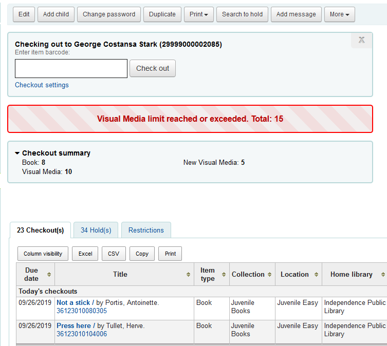

## Problem
We use two item types for many categories so that rules can be defined for new items (i.e. Visual Media vs. New Visual Media). There's no way to enforce a single limit on these combined item types.

## Solution
While a limit cannot be enforced, staff can be made aware when a patron reaches the limit. This project leverages the "Checkouts by item type" summary to notify staff when a patron reaches a combined limit on visual media items.



## JS

### Open and move summary
Opens the summary by default, adds a new class to it, and moves it above the checkouts table.

```js
$('.checkouts-by-itemtype').attr('open', '').addClass('checkout-summary').insertAfter('#circ_circulation #mainform');
```

### Add and style the box title
Changes wording to "Checkout summary".

```js
$('.checkout-summary summary').text('Checkout summary').css({'font-size' : '105%', 'font-weight' : '700'});
```
### Style the summary box
Adds background color and border, and emphasizes the number of items in each item type.
```js
//background color and border
$('.checkout-summary').css({'background-color' : '#f4f8f9', 'border' : '2px solid #b9d8d9', 'border-radius' : '5px', 'margin' : '1em 0', 'padding' : '1em'});

//list styling
$('.checkout-summary ul li').css({'list-style-type' : 'none', 'display' : 'inline-block', 'margin-right' : '1em', 'padding-top' : '2px', 'width' : '45%'});

//remove 'strong' tags from the item types and replace them around the numbers
$('.checkout-summary strong').contents().unwrap();
$('.checkout-summary ul li').html(function(i, v) {
    return v.replace(/(\d){1,2}/g, '<strong>$&</strong>');
});
```

### Add a class to targeted item types
Adds the `visualMedia` class to each number that will be considered for the limit calculation. For us, choosing 'Visual Media' catches both regular and new visual media. We also add the class to our 'ILL: Shorter' item type as those are generally also visual media items.
```js
$('.checkout-summary ul li:contains("Visual Media")').addClass('visualMedia');
$('.checkout-summary ul li:contains("Incoming ILL: Shorter Term")').addClass('visualMedia');
```

### Define a variable for sum calculation
Start the visual media sum at 0.
```js
var vmSum = 0
```

### Store the logged in library in a variable
We reference this to enforce different limits at different branches.
```js
var libcode = $('#logged-in-info-full .logged-in-branch-code').text();
```

### Set up individual limits by branch
Each branch can choose the threshhold for the warning to appear.
```js
var vmLimit2 = ['BRONSON', 'HUMBOLDT', 'PLEASANTON', 'WALNUT', 'YATESCTR']
var vmLimit3 = ['ARMA', 'CANEY']
var vmLimit4 = ['BLUEMOUND', 'CEDARVALE', 'INDYCC', 'PARKER', 'SEDAN']
var vmLimit5 = ['ALTOONA', 'COFFEYVILL', 'CHERRYVALE', 'FREDONIA', 'MCCUNE', 'MOUNDCITY', 'PRESCOTT']
var vmLimit6 = ['KINCAID']
var vmLimit10 = ['COLONY', 'IOLA', 'MORAN', 'TORONTO']
var vmLimit20 = ['COLUMBUS']
var vmLimit30 = ['ERIE']
```

### Calculate total items with targeted item type
Grabs the number for each item type with a .visualMedia class and totals them.
```js
$('.visualMedia strong').each(function(){
    vmSum += parseFloat($(this).text());
});
```

### Compare calculation with arrays
Compares the calculated sum (vmSum) to a value associated with each array and checks to see if the logged in library matches any of the libraries in the array. If the sum is greater than or equal to the limit, and the logged in library is in the array for that limit, a warning is inserted above the checkout summary.
```js
if ((vmSum >= 2 && $.inArray(libcode, vmLimit2) != -1) || (vmSum >= 3 && $.inArray(libcode, vmLimit3) != -1) ||
    (vmSum >= 4 && $.inArray(libcode, vmLimit4) != -1) || (vmSum >= 5 && $.inArray(libcode, vmLimit5) != -1) ||
    (vmSum >= 6 && $.inArray(libcode, vmLimit6) != -1) || (vmSum >= 10 && $.inArray(libcode, vmLimit10) != -1) ||
    (vmSum >= 20 && $.inArray(libcode, vmLimit20) != -1) || (vmSum >= 30 && $.inArray(libcode, vmLimit30) != -1)){
    $('.checkouts-by-itemtype').before('<div style="background:repeating-linear-gradient(45deg,#f2eeee,#f2eeee 20px, #f2dede 20px, #f2dede 40px);border:2px solid red;border-radius:5px;margin:1em 0;padding:1em;color:#bd0000;text-align:center;font-weight:bold;font-size:larger;">Visual Media limit reached or exceeded. Total: ' + vmSum + '</div>');
}
```

## Complete Code:
> ***Important***:
>
> Most jquery is wrapped in `$(document).ready(function, () { ... });`
>
> To avoid duplication, we only want this to run once per page load so it's wrapped in `$(document).one("ajaxStop", function() { ... });`

### IntranetUserJS
```js
//Checkout Summary and Visual Media limit warning
$(document).one("ajaxStop", function() {
$('.checkouts-by-itemtype').attr('open', '').addClass('checkout-summary').insertAfter('#circ_circulation #mainform');
$('.checkout-summary summary').text('Checkout summary').css({'font-size' : '105%', 'font-weight' : '700'});
$('.checkout-summary').css({'background-color' : '#f4f8f9', 'border' : '2px solid #b9d8d9', 'border-radius' : '5px', 'margin' : '1em 0', 'padding' : '1em'});
$('.checkout-summary strong').contents().unwrap();
$('.checkout-summary ul li').css({'list-style-type' : 'none', 'display' : 'inline-block', 'margin-right' : '1em', 'padding-top' : '2px', 'width' : '45%'});
$('.checkout-summary ul li').html(function(i, v) {
    return v.replace(/(\d){1,2}/g, '<strong>$&</strong>');
});

$('.checkout-summary ul li:contains("Visual Media")').addClass('visualMedia');
$('.checkout-summary ul li:contains("Incoming ILL: Shorter Term")').addClass('visualMedia');

var vmSum = 0
var libcode = $('#logged-in-info-full .logged-in-branch-code').text();
var vmLimit2 = ['BRONSON', 'HUMBOLDT', 'PLEASANTON', 'WALNUT', 'YATESCTR']
var vmLimit3 = ['ARMA', 'CANEY']
var vmLimit4 = ['BLUEMOUND', 'CEDARVALE', 'INDYCC', 'PARKER', 'SEDAN']
var vmLimit5 = ['ALTOONA', 'COFFEYVILL', 'CHERRYVALE', 'FREDONIA', 'MCCUNE', 'MOUNDCITY', 'PRESCOTT']
var vmLimit6 = ['KINCAID']
var vmLimit10 = ['COLONY', 'IOLA', 'MORAN', 'TORONTO']
var vmLimit20 = ['COLUMBUS']
var vmLimit30 = ['ERIE']
$('.visualMedia strong').each(function(){
    vmSum += parseFloat($(this).text());
});

if ((vmSum >= 2 && $.inArray(libcode, vmLimit2) != -1) || (vmSum >= 3 && $.inArray(libcode, vmLimit3) != -1) ||
    (vmSum >= 4 && $.inArray(libcode, vmLimit4) != -1) || (vmSum >= 5 && $.inArray(libcode, vmLimit5) != -1) ||
    (vmSum >= 6 && $.inArray(libcode, vmLimit6) != -1) || (vmSum >= 10 && $.inArray(libcode, vmLimit10) != -1) ||
    (vmSum >= 20 && $.inArray(libcode, vmLimit20) != -1) || (vmSum >= 30 && $.inArray(libcode, vmLimit30) != -1)){
    $('.checkouts-by-itemtype').before('<div style="background:repeating-linear-gradient(45deg,#f2eeee,#f2eeee 20px, #f2dede 20px, #f2dede 40px);border:2px solid red;border-radius:5px;margin:1em 0;padding:1em;color:#bd0000;text-align:center;font-weight:bold;font-size:larger;">Visual Media limit reached or exceeded. Total: ' + vmSum + '</div>');
}
});
```
