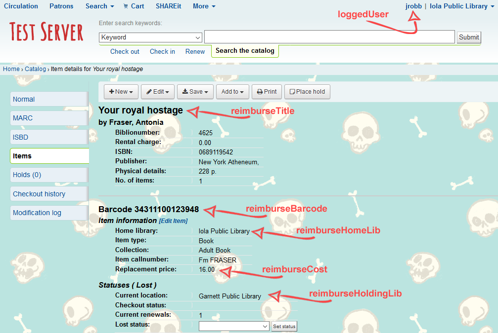

_Created and tested in Koha 17.05.09 in Firefox_

## Problem

A patron at Library A borrows and loses an item owned by Library B. Library A charges their patron for the item, but neglects to provide reimbursement or replacement for the item to Library B.

## Solution

When an item that is owned by another library is marked lost, interrupt the process with a warning and the opportunity to print a reminder/invoice.

<iframe src="https://www.youtube.com/embed/e1tmEg17bnw?rel=0" allow="autoplay; encrypted-media" allowfullscreen="" style="display: block; margin:0 auto;" width="560" height="315" frameborder="0"></iframe>

## Breakdown:

### IntranetUserJS

1.  Retrieve info from the page and store in variables
2.  Build HTML components (modal, printable div)
3.  Input variables into HTML
4.  Add conditions for activating the code
5.  Add functionality to the buttons

### IntranetUserCSS

1.  Set glowing rules for various browsers
2.  Assign glowing rules to a specific class

## JS

#### Retrieve info from the page and store in variables

Each variable is pulled from the page and used either on the modal itself, or on the print dialog that opens. Variables include the current date, home library of the item, holding library of the item, replacement cost, title, barcode, and the currently logged in user’s name.



```js
var reimburseCurDate = $.datepicker.formatDate('mm/dd/yy', new Date());
var reimburseHomeLib = $("#catalog_moredetail .bibliodetails:eq(1) > li").first().contents().filter(function() {
	return this.nodeType == 3;
}).text();
var reimburseHoldingLib = $("#catalog_moredetail .bibliodetails:eq(2) > li").first().contents().filter(function() {
	return this.nodeType == 3;
}).text();
var reimburseCost = $("#catalog_moredetail .bibliodetails:eq(1) > li").last().contents().filter(function() {
    return this.nodeType == 3;
}).text();
var reimburseTitle = $("#catalog_moredetail #catalogue_detail_biblio h2").text();
var reimburseBarcode = $("#catalog_moredetail #catalogue_detail_biblio h3").text();
var loggedUser = $(".loggedinusername").text();
```

#### Build HTML components

HTML is built in multiple htmlStr lines to make it easier to read and modify. This code creates a modal using existing classes so styles will match existing modals in Koha. Aside from the modal, a hidden div is created to produce the printable reminder. Classes are assigned to components that will be filled with variable data.

```js
htmlStr = '<div id="reimburseModal" class="modal fade in">';
htmlStr += '<div class="modal-dialog">';
htmlStr += '<div class="modal-content">';
htmlStr += '<form class="confirm">';
htmlStr += '<div class="modal-header">';
htmlStr += '<h2>Wait! This is <u>not</u> your item!</h2>';
htmlStr += '</div>';
htmlStr += '<div class="modal-body">';
htmlStr += '<p>This item belongs to<b><span class="reimburseHomeLib"></span></b></p>';
htmlStr += '<p>By marking this item lost, you agree to replace at full replacement cost: <span class="reimburseCost"></span></p>';
htmlStr += '</div>';
htmlStr += '<div id="reimburseReminder" style="display:none;">';
htmlStr += '<h3>Notice of Reimbursement</h3>';
htmlStr += '<hr>';
htmlStr += '<p>Date: <span class="reimburseCurDate"></span></p>';
htmlStr += '<p>This notice acts as a reminder for <span class="reimburseHoldingLib"></span>to reimburse <span class="reimburseHomeLib" style="font-weight:bold;"></span>in the amount of <span class="reimburseCost" style="font-weight: bold;"></span>for <span class="reimburseTitle" style="text-decoration: underline;"></span> ( <span class="reimburseBarcode"></span>).</p>';
htmlStr += '<p style="font-style: italic;">Managed by: <span class="loggedUser"></span></p>';
htmlStr += '<hr>';
htmlStr += '</div>';
htmlStr += '<div class="modal-footer">';
htmlStr += '<a id="printReminder" class="btn btn-default print">';
htmlStr += '<i class="fa fa-print"></i> Print a reminder</a>';
htmlStr += '<a id="closeReimburseModal" aria-hidden="true" type="submit" class="btn btn-danger deny">Close</a>';
htmlStr += '</div>';
htmlStr += '</form>';
htmlStr += '</div>';
htmlStr += '</div>';
htmlStr += '</div>';
htmlStr += '<div class="modal-backdrop fade in" style="display:none;"></div>';
$("#catalogue_detail_biblio").append(htmlStr);
```

#### Input Variables into HTML

The classes assigned in the HTML above are used to insert the data stored in the earlier defined variables.

```js
$(".reimburseCurDate").html(reimburseCurDate);
$(".reimburseHomeLib").html(reimburseHomeLib);
$(".reimburseHoldingLib").html(reimburseHoldingLib);
$(".reimburseCost").html(reimburseCost);
$(".reimburseTitle").html(reimburseTitle);
$(".reimburseBarcode").html(reimburseBarcode);
$(".loggedUser").html(loggedUser);
```

#### Add conditions for activating the code

Two conditions must be met before the code activates. First, the url must contain “itemnumber=” to ensure that only one item is displayed on the screen and all variables retrieved are accurate to that item. Second, the home library of the item must not match the current location of the item. If both criteria are met, then the onchange function is allowed to fire – whenever the value of the lost item dropdown changes to something other than 0, the modal will reveal.

```js
//Determine if owner differs from holder
if ((window.location.href.indexOf("itemnumber=") > -1) && (reimburseHomeLib != reimburseHoldingLib)) { //only trigger if a single item is selected, and item home library does not match current library
	$("select[name=itemlost]").change(function() {
     	if ($(this).val() != "0") { //trigger when the item lost dropdown is changed to a value other than 'blank'
      		$("#reimburseModal").css("display", "block"); //pop up modal
      		$(".modal-backdrop").css("display", "block"); //pop up modal backdrop
      	}
    });
}
```

#### Add functionality to buttons

The buttons need to know how to behave.

For the “Print” button, the following functionality was added:

*   Open a new window
*   Populate the window with data from the aforementioned hidden div
*   Open the print dialog
*   Close the print window after printing
*   Close the modal and modal backdrop after printing
*   Add a ‘glow’ class to the ‘set status’ button after printing

```js
//Print reminder button
$("#printReminder").click(function() {
    w = window.open(); //open print window when button is clicked
    w.document.write($('#reimburseReminder').html()); //capture only data in the reiminder div
    w.print(); //open print dialog
    w.close(); //close print window after printing/closing print dialog
    $("#reimburseModal").css("display", "none"); //close the modal when print button is clicked
    $(".modal-backdrop").css("display", "none"); //remove backdrop when print button is clicked
    $("#catalog_moredetail input[value='Set status']").first().addClass("buttonglow"); //emphasize set status button
});
```

For the “Close” button, the following functionality was added:

*   Close the modal and modal backdrop
*   Add a ‘glow’ class to the ‘set status’ button

```js
//Close button
$("#closeReimburseModal").click(function() {
    $("#reimburseModal").css("display", "none"); //close modal when close button is clicked
    $(".modal-backdrop").css("display", "none"); //close backdrop when close button is clicked
    $("#catalog_moredetail input[value='Set status']").first().addClass("buttonglow"); //emphasize set status button
    });
});
```

## CSS

#### Set glowing rules for various browsers
```css
@-webkit-keyframes glowing {
  0% { background-color: #B20000; -webkit-box-shadow: 0 0 3px #B20000; }
  50% { background-color: #FF0000; -webkit-box-shadow: 0 0 40px #FF0000; }
  100% { background-color: #B20000; -webkit-box-shadow: 0 0 3px #B20000; }
}

@-moz-keyframes glowing {
  0% { background-color: #B20000; -moz-box-shadow: 0 0 3px #B20000; }
  50% { background-color: #FF0000; -moz-box-shadow: 0 0 40px #FF0000; }
  100% { background-color: #B20000; -moz-box-shadow: 0 0 3px #B20000; }
}

@-o-keyframes glowing {
  0% { background-color: #B20000; box-shadow: 0 0 3px #B20000; }
  50% { background-color: #FF0000; box-shadow: 0 0 40px #FF0000; }
  100% { background-color: #B20000; box-shadow: 0 0 3px #B20000; }
}

@keyframes glowing {
  0% { background-color: #B20000; box-shadow: 0 0 3px #B20000; }
  50% { background-color: #FF0000; box-shadow: 0 0 40px #FF0000; }
  100% { background-color: #B20000; box-shadow: 0 0 3px #B20000; }
}
```
#### Add the glow to a certain class
```css
.buttonglow {
  -webkit-animation: glowing 1500ms infinite;
  -moz-animation: glowing 1500ms infinite;
  -o-animation: glowing 1500ms infinite;
  animation: glowing 1500ms infinite;
}
```
## Complete Code:

### IntranetUserJS
```js
//Nacho item modal
//Alerts staff if they are about to mark an item lost that isn't theirs
$(document).ready(function() {
    //Get variables to populate modal and print reminder
    var reimburseCurDate = $.datepicker.formatDate('mm/dd/yy', new Date());
    var reimburseHomeLib = $("#catalog_moredetail .bibliodetails:eq(1) > li").first().contents().filter(function() {
        return this.nodeType == 3;
    }).text();
    var reimburseHoldingLib = $("#catalog_moredetail .bibliodetails:eq(2) > li").first().contents().filter(function() {
        return this.nodeType == 3;
    }).text();
    var reimburseCost = $("#catalog_moredetail .bibliodetails:eq(1) > li").last().contents().filter(function() {
        return this.nodeType == 3;
    }).text();
    var reimburseTitle = $("#catalog_moredetail #catalogue_detail_biblio h2").text();
    var reimburseBarcode = $("#catalog_moredetail #catalogue_detail_biblio h3").text();
    var loggedUser = $("#logged-in-info-full .loggedinusername").text();

    //Generate html for the modal and print notice
    htmlStr = '<div id="reimburseModal" class="modal fade in">';
    htmlStr += '<div class="modal-dialog">';
    htmlStr += '<div class="modal-content">';
    htmlStr += '<form class="confirm">';
    htmlStr += '<div class="modal-header">';
    htmlStr += '<h2>Wait! This is <u>not</u> your item!</h2>';
    htmlStr += '</div>';
    htmlStr += '<div class="modal-body">';
    htmlStr += '<p>This item belongs to<b><span class="reimburseHomeLib"></span></b></p>';
    htmlStr += '<p>By marking this item lost, you agree to replace at full replacement cost: <span class="reimburseCost"></span></p>';
    htmlStr += '</div>';
    htmlStr += '<div id="reimburseReminder" style="display:none;">';
    htmlStr += '<h3>Notice of Reimbursement</h3>';
    htmlStr += '<hr>';
    htmlStr += '<p>Date: <span class="reimburseCurDate"></span></p>';
    htmlStr += '<p>This notice acts as a reminder for <span class="reimburseHoldingLib"></span>to reimburse <span class="reimburseHomeLib" style="font-weight:bold;"></span>in the amount of <span class="reimburseCost" style="font-weight: bold;"></span>for <span class="reimburseTitle" style="text-decoration: underline;"></span> ( <span class="reimburseBarcode"></span>).</p>';
    htmlStr += '<p style="font-style: italic;">Managed by: <span class="loggedUser"></span></p>';
    htmlStr += '<hr>';
    htmlStr += '</div>';
    htmlStr += '<div class="modal-footer">';
    htmlStr += '<a id="printReminder" class="btn btn-default print">';
    htmlStr += '<i class="fa fa-print"></i> Print a reminder</a>';
    htmlStr += '<a id="closeReimburseModal" aria-hidden="true" type="submit" class="btn btn-danger deny">Close</a>';
    htmlStr += '</div>';
    htmlStr += '</form>';
    htmlStr += '</div>';
    htmlStr += '</div>';
    htmlStr += '</div>';
    htmlStr += '<div class="modal-backdrop fade in" style="display:none;"></div>';

    $("#catalogue_detail_biblio").append(htmlStr);

    //Input variables into html
    $(".reimburseCurDate").html(reimburseCurDate);
    $(".reimburseHomeLib").html(reimburseHomeLib);
    $(".reimburseHoldingLib").html(reimburseHoldingLib);
    $(".reimburseCost").html(reimburseCost);
    $(".reimburseTitle").html(reimburseTitle);
    $(".reimburseBarcode").html(reimburseBarcode);
    $(".loggedUser").html(loggedUser);

    //Determine if owner differs from holder
    if ((window.location.href.indexOf("itemnumber=") > -1) && (reimburseHomeLib != reimburseHoldingLib)) { //only trigger if a single item is selected, and item home library does not match current library
        $("select[name=itemlost]").change(function() {
            if ($(this).val() != "0") { //trigger when the item lost dropdown is changed to a value other than 'blank'
                $("#reimburseModal").css("display", "block"); //pop up modal
                $(".modal-backdrop").css("display", "block"); //pop up modal backdrop
            }
        });
    }

    //Print reminder button
    $("#printReminder").click(function() {
        w = window.open(); //open print window when button is clicked
        w.document.write($('#reimburseReminder').html()); //capture only data in the reiminder div
        w.print(); //open print dialog
        w.close(); //close print window after printing/closing print dialog
        $("#reimburseModal").css("display", "none"); //close the modal when print button is clicked
        $(".modal-backdrop").css("display", "none"); //remove backdrop when print button is clicked
        $("#catalog_moredetail input[value='Set status']").first().addClass("buttonglow"); //emphasize set status button
    });

    //Close button
    $("#closeReimburseModal").click(function() {
        $("#reimburseModal").css("display", "none"); //close modal when close button is clicked
        $(".modal-backdrop").css("display", "none"); //close backdrop when close button is clicked
        $("#catalog_moredetail input[value='Set status']").first().addClass("buttonglow"); //emphasize set status button
    });
});
```
### IntranetUserCSS
```css
@-webkit-keyframes glowing {
  0% { background-color: #B20000; -webkit-box-shadow: 0 0 3px #B20000; }
  50% { background-color: #FF0000; -webkit-box-shadow: 0 0 40px #FF0000; }
  100% { background-color: #B20000; -webkit-box-shadow: 0 0 3px #B20000; }
}

@-moz-keyframes glowing {
  0% { background-color: #B20000; -moz-box-shadow: 0 0 3px #B20000; }
  50% { background-color: #FF0000; -moz-box-shadow: 0 0 40px #FF0000; }
  100% { background-color: #B20000; -moz-box-shadow: 0 0 3px #B20000; }
}

@-o-keyframes glowing {
  0% { background-color: #B20000; box-shadow: 0 0 3px #B20000; }
  50% { background-color: #FF0000; box-shadow: 0 0 40px #FF0000; }
  100% { background-color: #B20000; box-shadow: 0 0 3px #B20000; }
}

@keyframes glowing {
  0% { background-color: #B20000; box-shadow: 0 0 3px #B20000; }
  50% { background-color: #FF0000; box-shadow: 0 0 40px #FF0000; }
  100% { background-color: #B20000; box-shadow: 0 0 3px #B20000; }
}

.buttonglow {
  -webkit-animation: glowing 1500ms infinite;
  -moz-animation: glowing 1500ms infinite;
  -o-animation: glowing 1500ms infinite;
  animation: glowing 1500ms infinite;
}
```
