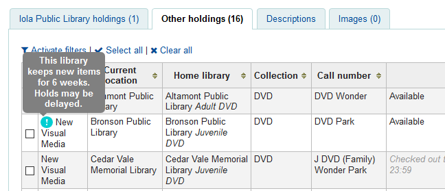
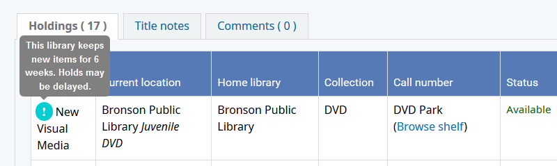
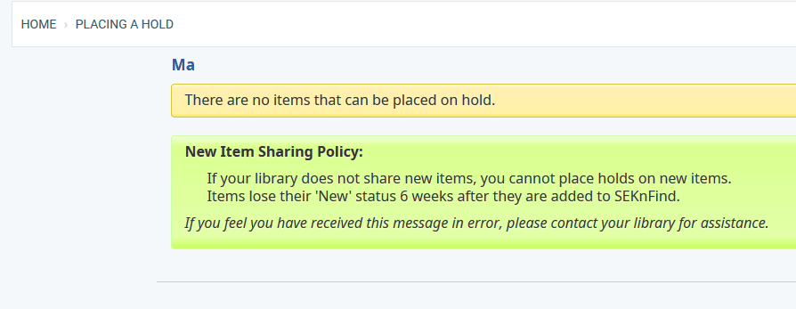

Customizations on this page relate to our 'New Item Sharing' setup, which allows libraries to select from two 'New Item Sharing' models:
* Immediate (Sharks):  These libraries freely share new items as soon as possible, and are able to place holds on new items as soon as they are cataloged
* Delayed (Fish): These libraries withhold their new items for 6 weeks, and are not allowed to place holds on new items until they hit the 6-week mark

## Tooltips
Adds tooltips to the catalog detail pages to indicate when sharing of an item will be delayed.
### Staff


#### JS
```js
//Add tooltip to new items belonging to delayed sharers
$(document).ready(function() {
    $('td.homebranch:contains(Arma), td.homebranch:contains(Bronson), td.homebranch:contains(Colony), td.homebranch:contains(Columbus), td.homebranch:contains(Oswego), td.homebranch:contains(Pleasanton)').siblings('td.itype:contains(New)').prepend("<div class='fishtip'>!<span class='fishtiptext'>This library keeps new items for 6 weeks. Holds may be delayed.</span></div>");
});
```

#### CSS
```css
/*---New Item Sharing---*/

.fishtip {
    background-color: darkturquoise;
    border-radius: 20px;
    color: white;
    cursor: pointer;
    display: inline-block;
    font-family: caption;
    font-weight: bold;
    height: 17px;
    margin-left: -1%;
    padding-top: 1px;
    position: relative;
    text-align: center;
    width: 18px;
}

.fishtip .fishtiptext::after {
    border-color: gray transparent transparent;
    border-style: solid;
    border-width: 5px;
    content: " ";
    left: 50%;
    margin-left: -35px;
    position: absolute;
    top: 100%;
}

.fishtip:hover .fishtiptext {
    visibility: visible;
}

.fishtip .fishtiptext {
    background-color: grey;
    border-radius: 6px;
    bottom: 130%;
    color: #fff;
    font-family: arial;
    font-size: small;
    left: 50%;
    margin-left: -35px;
    padding: 5px;
    position: absolute;
    text-align: center;
    visibility: hidden;
    width: 120px;
    z-index: 1;
}

.select2-results .select2-disabled {
    display: none !important;
}

.new-itype-highlight {
    background-color: #b1edb1 !important;
}

.new-itype-highlight:hover {
    background-color: #3875D7!important;
}
```
### OPAC


#### JS
```js
//----OPAC New Sharing Tooltip----//
$(document).ready(function() {
  $('td.location:contains(Arma), td.location:contains(Bronson), td.location:contains(Columbus), td.location:contains(Oswego), td.location:contains(Pleasanton)').siblings('td.itype:contains(New)').prepend("<div class='fishtip'>!<span class='fishtiptext'>This library keeps new items for 6 weeks. Holds may be delayed.</span></div>");
});
```

#### CSS
```css
/*--OPAC--*/

.fishtip {
    background-color: darkturquoise;
    border-radius: 25px;
    color: white;
    cursor: pointer;
    display: inline-block;
    font-family: caption;
    font-size: large;
    font-weight: bold;
    height: 19px;
    margin-left: -4%;
    padding-bottom: 8px;
    position: relative;
    text-align: center;
    width: 25px;
}

.fishtip .fishtiptext::after {
    border-color: gray transparent transparent;
    border-style: solid;
    border-width: 5px;
    content: " ";
    left: 50%;
    margin-left: -35px;
    position: absolute;
    top: 100%;
}

.fishtip:hover .fishtiptext {
    visibility: visible;
}

.fishtip .fishtiptext {
    background-color: grey;
    border-radius: 6px;
    bottom: 130%;
    color: #fff;
    font-family: arial;
    font-size: small;
    left: 50%;
    margin-left: -35px;
    padding: 5px;
    position: absolute;
    text-align: center;
    visibility: hidden;
    width: 120px;
    z-index: 1;
}
```

## OPAC Policy Alert
Inform patrons that they cannot place a hold because their library doesn't share new items.



#### JS
```js
//----OPAC NoShare Alert----//
$(document).ready(function() {
var0 = $('body').is("#opac-holds.branch-ARMA") || $('body').is("#opac-holds.branch-BRONSON") || $('body').is("#opac-holds.branch-COLUMBUS") || $('body').is("#opac-holds.branch-OSWEGO") || $('body').is("#opac-holds.branch-PLEASANTON");
if(var0 !=0) {
   $(".alert:contains('There are no items that can be placed on hold.')").after("<div id='newsharepolicy' class='alert'><p><b>New Item Sharing Policy:</b><ul><li>If your library does not share new items, you cannot place holds on new items.</li><li>Items lose their 'New' status 6 weeks after they are added to SEKnFind.</li></ul></p><p><em>If you feel you have received this message in error, please contact your library for assistance.</em></p></div>");
}
});
```

#### CSS
```css
#newsharepolicy {
    background: rgba(0, 0, 0, 0) linear-gradient(to bottom, #f3ffdb 0px, #daff8f 9%, #e2ffa8 89%, #c9ff5c 100%) repeat scroll 0 0;
    border-color: #ccffa8;
}
```

## Holds Queue Modifications
Hides requests made by delayed sharers on other libraries' queues and recalculates the hold count.


```js
//Filter out 'New' item requests on the holds queue based on shark/fish
$(document).ready(function() {
  var libcode = $('#logged-in-info-full .logged-in-branch-code').text();

  //Hide New Items from Fish
  $("td.hq-itemtype:contains('New')").siblings("td.hq-sendto:contains('Arma'), td.hq-sendto:contains('Bronson'), td.hq-sendto:contains('Colony'), td.hq-sendto:contains('Columbus'), td.hq-sendto:contains('Oswego'), td.hq-sendto:contains('Pleasanton')").parent().hide();
  //Only show new item holds for Arma patrons at Arma
  if (libcode === "ARMA") {
    $("td.hq-itemtype:contains('New')").siblings("td.hq-sendto:contains('Arma')").parent().show();
    $("td.hq-itemtype:contains('New')").siblings("td.hq-sendto:contains('Bronson'), td.hq-sendto:contains('Colony'), td.hq-sendto:contains('Columbus'), td.hq-sendto:contains('Oswego'), td.hq-sendto:contains('Pleasanton')").parent().hide();
  //Only show new item holds for Bronson patrons at Bronson
  } else if (libcode === "BRONSON") {
    $("td.hq-itemtype:contains('New')").siblings("td.hq-sendto:contains('Bronson')").parent().show();
    $("td.hq-itemtype:contains('New')").siblings("td.hq-sendto:contains('Arma'), td.hq-sendto:contains('Colony'), td.hq-sendto:contains('Columbus'), td.hq-sendto:contains('Oswego'), td.hq-sendto:contains('Pleasanton')").parent().hide();
  //Only show new item holds for Colony patrons at Colony
  } else if (libcode === "COLONY") {
    $("td.hq-itemtype:contains('New')").siblings("td.hq-sendto:contains('Colony')").parent().show();
    $("td.hq-itemtype:contains('New')").siblings("td.hq-sendto:contains('Arma'), td.hq-sendto:contains('Bronson'), td.hq-sendto:contains('Columbus'), td.hq-sendto:contains('Oswego'), td.hq-sendto:contains('Pleasanton')").parent().hide();
  //Only show new item holds for Columbus patrons at Columbus
  } else if (libcode === "COLUMBUS") {
    $("td.hq-itemtype:contains('New')").siblings("td.hq-sendto:contains('Columbus')").parent().show();
    $("td.hq-itemtype:contains('New')").siblings("td.hq-sendto:contains('Arma'), td.hq-sendto:contains('Bronson'), td.hq-sendto:contains('Colony'), td.hq-sendto:contains('Oswego'), td.hq-sendto:contains('Pleasanton')").parent().hide();
  //Only show new item holds for Oswego patrons at Oswego
  } else if (libcode === "OSWEGO") {
    $("td.hq-itemtype:contains('New')").siblings("td.hq-sendto:contains('Oswego')").parent().show();
    $("td.hq-itemtype:contains('New')").siblings("td.hq-sendto:contains('Arma'), td.hq-sendto:contains('Bronson'), td.hq-sendto:contains('Colony'), td.hq-sendto:contains('Columbus'), td.hq-sendto:contains('Pleasanton')").parent().hide();
  //Only show new item holds for Pleasanton patrons at Pleasanton
  } else if (libcode === "PLEASANTON") {
    $("td.hq-itemtype:contains('New')").siblings("td.hq-sendto:contains('Pleasanton')").parent().show();
    $("td.hq-itemtype:contains('New')").siblings("td.hq-sendto:contains('Arma'), td.hq-sendto:contains('Bronson'), td.hq-sendto:contains('Colony'), td.hq-sendto:contains('Columbus'), td.hq-sendto:contains('Oswego')").parent().hide();
  }
});


//Fix visible row count when delayed sharer holds are hidden
$(window).load(function() {
   var numOfVisibleRows = $('#holdst tr:visible').length-2;
   var loggedInLib = $('#logged-in-info-full .logged-in-branch-name').text();

   $("#circ_view_holdsqueue .results").text(numOfVisibleRows + ' item(s) found.');
});
```
