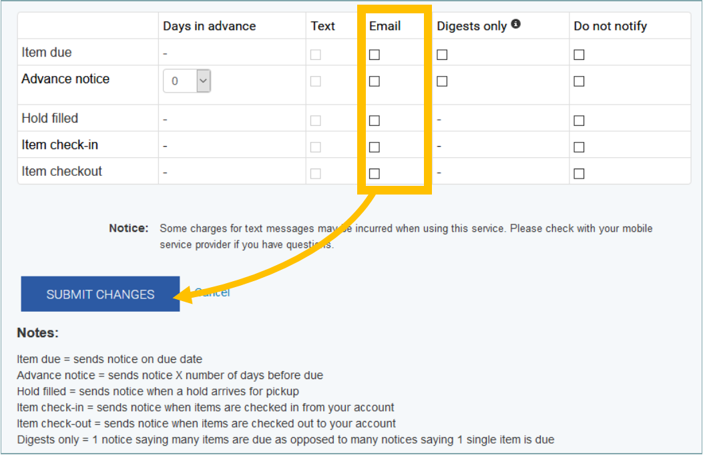

## Logging in
1. Click **Log in to your account** in the upper right corner

2. Enter **Username/login** and **Password** then click **Log in**

> #### Tips
> - Usernames and passwords are set up by library staff when a patron registers for their library account
> - Users can recover their password with the **Forgot your password?** link
> - Passwords cannot be retrieved, but they can be reset by a library staff member.
> - As a security measure, multiple failed login attempts will lock the account, and the password will need reset with the **Forgot your password?** link, or by library staff.

## Searching

### Basic Search
Choose filters, type in search terms, then hit enter or click **Go**

### Advanced Search
Click on *Advanced search* to the lower right of the main search bar.

This allows for a more refined search and offers different ways to browse the collection.

> #### Tips
> - *Don't use too many words* - if your title is really long, try searching with fewer words to get more results.
> - *Don't use too few words* - if your title is short, try adding the author's last name or actor's last name.
> - *Leave out digits* - if you're searching for a title with a number in it, either leave the number off or type out the word (i.e. Terminator Two instead of Terminator 2).
> - *Leave out punctuation* - if the search isn't pulling back with a hyphen or apostrophe, try replacing the punctuation with a space.
> - *Check your spelling* - the search engine can sometimes guess at a mispelled word, but accurate spelling is more likely to give the correct result.

## Placing holds
1. Search for an item
2. Make sure you've found the item you want

3. Click **Place hold**

4. Click **Confirm hold** on the next screen

> #### Tips
> - You must be logged in to place holds
> - You can click into the record via the title for more information, and read-alike recommendations to help choose more titles to request
> - Visual materials include a format indicator -- make sure your hold is on a format you can use.
	
	
## Your Summary
Once logged in, click **Your Name** to access your summary anytime.

View current checkouts, holds and fines from the summary page.

Use the tabs on the left to complete various tasks

## Renewing items
Items may be renewed:

Individually with the *Renew* link

Several at once, using the checkboxes and the **Renew selected** button or link

All at once, using the **Renew all** button or link

A green box will confirm the renewal(s).

## Updating your information

### Changing your password
1. Click **Your name** in the top left to access your summary.
2. Click **Change your password** on the left.

3. Enter your **Current password** once and your **New password** twice

4. Click **Submit changes**

### Changing personal details
1. Click **Your name** to access your summary.
2. Click **Your personal details** in the left menu.

3. Add to or update info -- the fields in red are required.

4. Click **Submit update request** at the bottom

> - Note: A librarian must approve your changes before it reflects on your account.

## History
Click **Your name** to access your summary.

### Search history
Click **Your search history** on the left.

Previous searches are listed. You can delete searches as well as subscribe to searches via RSS to stay on top of newly added items.

### Reading history
Click **Your reading history** on the left.

You can view and sort your history to see past and present checkouts.

## Privacy

### Managing your reading history
1. Click **Your name** to access your summary.
2. Click **Your privacy** on the left.

3. Read through the options, and choose your **privacy rule**, then click **Save**

> #### Notes:
> - Deleted history CANNOT be recovered.
> - The default setting is to maintain history indefinitely.

### Parental access to child accounts
If a child account is linked to a parent account, the privacy page of the *child's* account will allow the child to choose to display current checkouts to the linked parent account.

## Purchase suggestions
1. Search for an item.
2. *When logged in*, a suggestion box appears at the end of each search results page, and whenever searches turn up no results.

3. In that box, click **purchase suggestion**

4. Fill in as much info as possible. Use outside sites like Amazon to fill in the blanks if needed.

5. Click **Submit your suggestion**

> #### Tips
> - You must be logge din to place purchase suggestions.
> - Your home library will manage the suggestion and make purchasing decisions.
> - Make sure you have an accurate email address on your account so you can be notified with status updates on the suggestion.
> - You can place new suggestions and monitor past suggestions from the **Your puchase suggestions** tab on your summary.

## Messaging
1. Click **Your name** to acceess your summary.
2. Click **Your messaging** on the left menu.

### Texting
1. Choose a provider.

2. Enter the number to use for texting.

3. Choose checkboxes for desired notices in the *Text* column. For advance notices, set how many days in advance you'd like the message.

4. Click **Submit changes**.

> #### Tips
> - If you are unsure of your provider, contact your library for help.
> - For services like StraightTalk and Net10, your provider will be the network chosen when the phone was activated, usually either Verizon, AT&T, Sprint or T-Mobile.
> - Digests will send one notice versus a single notice for each item.

### Email
1. Choose checkboxes for desired notices in the *Email* column. For advance notices, set how many days in advance you'd like the message.

2. Click **Submit changes**.

> #### Tips
> - Notices will send to the *Primary* email address associated with your account -- check your personal details to make sure this is up-to-date and accurate.
> - Digests will send one notice versus a single notice for each item.

## Lists

### Creating lists
1. Click **Your name** to access your summary.
2. Click **Your lists** on the left.

3. Click **New list**.

4. Fill in the requested info.

5. Click **Save**

### Adding to lists
1. Search the catalog.
2. For a single item:
	1. Click **Save to lists** on directly from the search results, or from the record detail view.
	
	2. Choose your list in the window that pops up.
	
	3. Click **Save**
	
3. For multiple items:
	1. From the search results list, check the box next to each item to add to the list.
	
	2. Choose your list from the **Add to...** dropdown.
	
	3. Click **Save** in the window that pops up.
	
## User-generated content
Pull up the material you'd like to rate by searching and click on the title.

*Note: You must be logged in to add tags, comments and star ratings.*
### Adding tags
Tags allow you to add your own search terms to a title.
1. Click **Add tags**.

2. Type tags into the box that appears, separated by commas, then click **Add**.

3. Click **(done)** when finished.

4. After a librarian approves your tag, it will appear on the record and in the tag cloud.

### Adding star ratings
Star ratings allow you to rate a title so others searching the catalog can see. To add a star rating, pull up the record and click on the number of stars you'd give the title.

### Adding comments
Comments are a place for you to review a title for other users to see. All comments are anonymous.

1. Click the **Comments** tab.

2. Click the **Post your comments on this item** link.

3. Write your comments in the window that pops up.

4. Click **Submit and close this window**

5. After a librarian approves the comment, it will appear on the record in the comments tab.

## Readers' advisory
### Reading suggestions
The SEKnFind Catalog is enriched with reading suggestions via EBSCO's NoveList Select service.

When you pull up a record with NoveList data, you will see similar titles, authors, series, and much more to help you pick your next read.

### Newsletters
Users of the SEKnFind Catalog also have access to NextReads Newsletters, which deliver reading suggestions directly to your inbox.

A link to subscribe to these newsletters can be found at the bottom of every page.

Newsletters are divided out by interest. You can unsubscribe any time.
