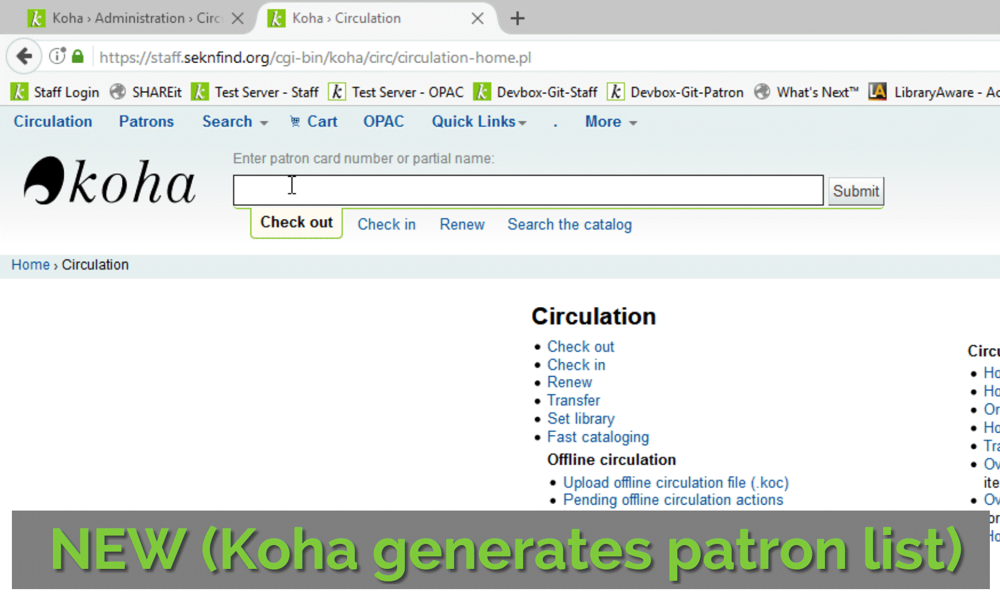

This toggles the patron search autofill feature provided by the `CircAutocompl` syspref based on logged in library.



## JS
The array defines which libraries want the feature disabled. If the logged in library matches a library in the array, then the autocomplete functions are destroyed.

```js
$(window).load(function() {
    var libcode = $('#logged-in-info-full .logged-in-branch-code').text();
    var acdisable = ['ALTAMONT', 'BRONSON', 'CHERRYVALE', 'ERIE', 'MORAN', 'PARKER', 'SAVONBURG', 'STPAUL', 'WALNUT', 'YATESCTR']
    
    if ($.inArray(libcode, acdisable) != -1) {
        $('#findborrower').autocomplete("destroy");
        $('#patron').autocomplete("destroy");      
    }
});
```