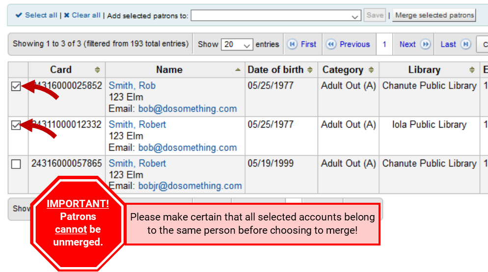

## Adding
1. Click **Patrons** on the top navigation bar

2. Click **+New patron** then choose a patron type

3. Fill in patron information

4. To finish, click **Save** at the top of the screen

>***Reminders***
>	- Fields in red are required
>	- The more info you can get, the better -- this helps identify duplicate patrons and accounts
>	- Overdues and noticers are sent to the *primary email address*
>	- Username and password allow the patron to access their account at www.seknfind.org
>	- Users can change their passwords on their own via the OPAC
		
## Merging
1. Click **Patrons** on the top navigation bar

2. Search for the patron in question

3. Check the boxes next to duplicate accounts

4. Click **Merge selected patrons**

5. Select the patron record you want to keep, then click **Merge patrons**

		
## Deleting
1. Search for the patron that needs deleted

2. Bring up the patron's checkout screen
3. Click **More** then **Delete**

4. Click **Yes, delete** to confirm deletion

## Messaging preferences
1. Navigate to the patron's **Details** view

2. Click **Edit** below the *Patron messaging preferences* table

3. Fill in the required information and check the boxes for desired notices.

4. Save your changes

>***Reminders***
>	- Digests can cut down on spam by collecting multiple messages from a day into a single notice
>	- For text messaging, you must provide a valid provider and number before you can select the appropriate checkboxes
>	- If the cell provider is unknown or not on the list, use the lookup link to determine which network is used and select that as the provider

## Adding patron images
1. Navigate to the patron's **Details** view

2. Under **Upload Patron Image**, click **Browse**

3. Find where the photo is stored, select it, and click **Open**

4. Click **Upload**

>***Reminders***
>	- File size is limited to 100K
>	- Recommended dimensions are 200x300 pixels, or smaller

## Fines
### Accessing
Open the patron account, choose **Fines** or **Make payment**

### Collecting
Fines can be collected by:

A. Clicking **Pay Amount** to apply an amount towards the total, then clicking **Confirm**

B. Clicking **Pay** to apply an amount towards an individual fine line, then clicking **Confirm**

	
### Writing off
Writeoffs should only be used if charges need forgiven or removed due to mistakes.

Fines can be written off by:

A. Clicking **Write off** next to an individual fine, then clicking **Write off this charge**

B. Clicking **Write off all** then clicking **OK** to confirm the full writeoff

## Manual Invoices
Manual invoices are used to add a charge to an account manually.

1. Click **Create manual invoice**

2. Fill in information

3. Click **Save**
