## Monthly Statistical Reports
For monthly stats, run it for the first of the month to the first of the following month. For example, June stats would run 6/1/2019 to 7/1/2019.

Common monthly reports can be found under **More** > **Reports** > **Quick statistics**

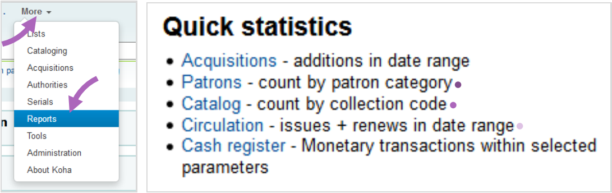

### Monthly circulation - Report #2155
Reports total circulation and renewals in a chosen date range, broken down by collection code. Excludes circulations to ILL patrons.

https://staff.seknfind.org/cgi-bin/koha/reports/guided_reports.pl?reports=2155&phase=Run%20this%20report

### Item Count - Report #1946
Reports total number of items at your library, broken down by collection code.

https://staff.seknfind.org/cgi-bin/koha/reports/guided_reports.pl?reports=1946&phase=Run%20this%20report

### Patron Count - Report #1944

Reports total number of registerd patrons at your library, broken down by patron category.
https://staff.seknfind.org/cgi-bin/koha/reports/guided_reports.pl?reports=1944&phase=Run%20this%20report

## Custom Reports

### Accessing Reports

1. Click **More** then **Reports**
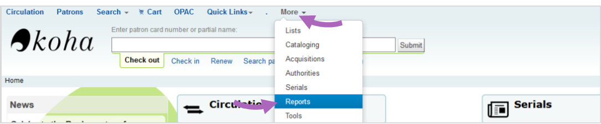

2. Click **Use saved** under **Guided reports**
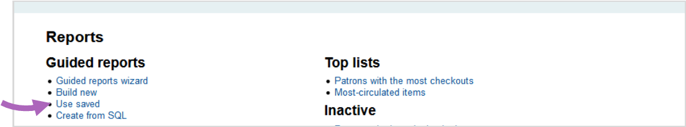

### Searching Reports
Use the **tabs** and the **search filter** to narrow results.
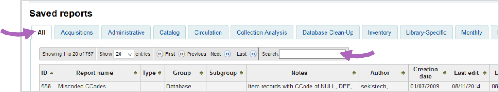

### Running reports
1. Click **Run** for the chosen reports
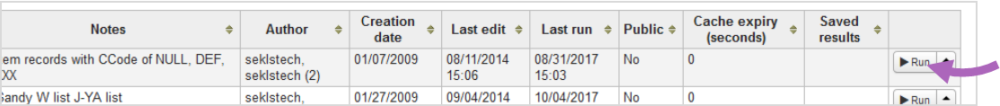
2. Fill in any **paramenters** then click **Run the report**
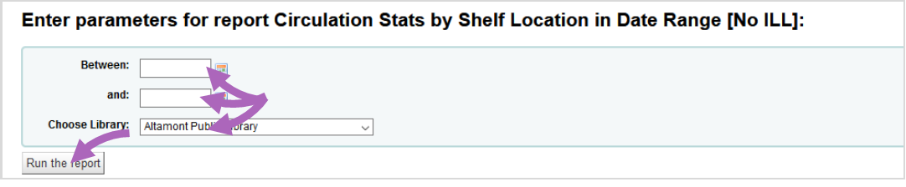

### Downloading reports
1. After the report has run, click **Download** then **Open Document Spreadsheet**
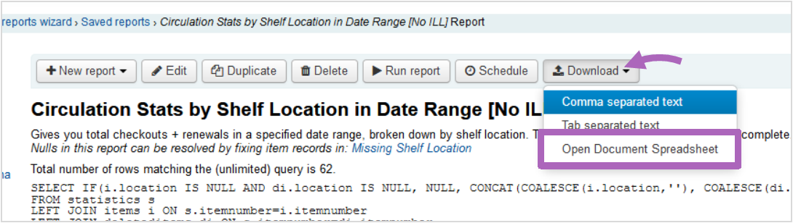
> Note: You may have to use Comma separated text for larger result sets.
2. Choose **Open with Microsoft Excel** and click **OK**
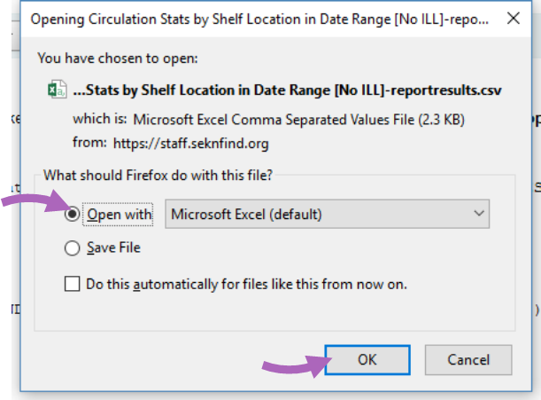
3. Use Excel to format and print reports
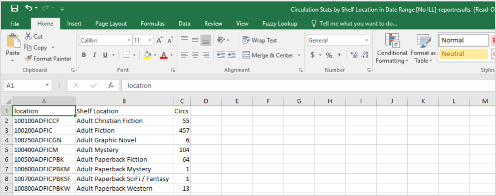

## [Excel Reference Sheet](https://www.dropbox.com/s/df4y625m3r9to0y/Excel_reference.pdf?dl=0)
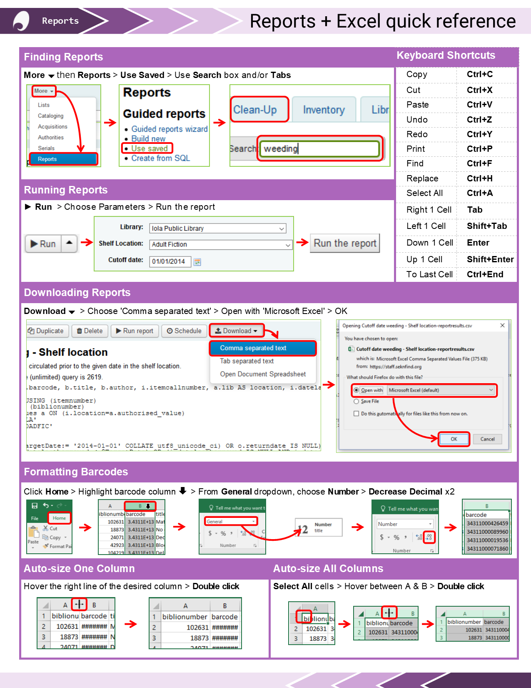
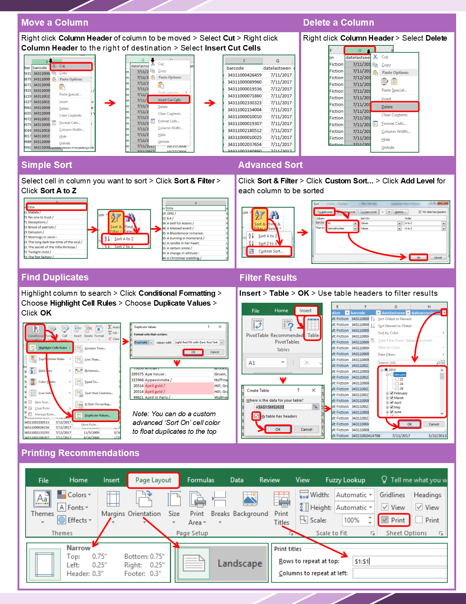