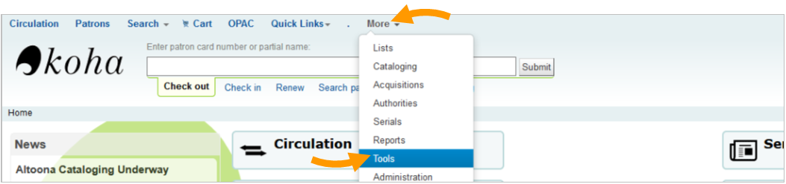
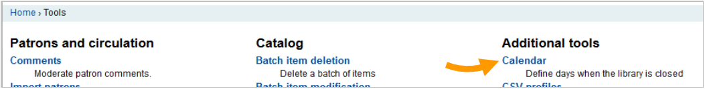
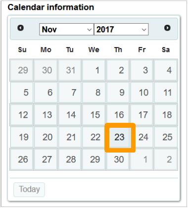
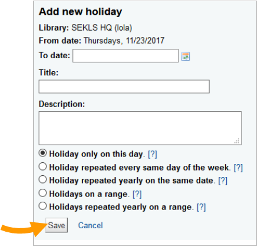
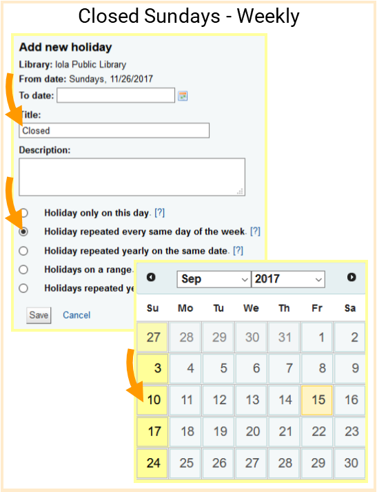
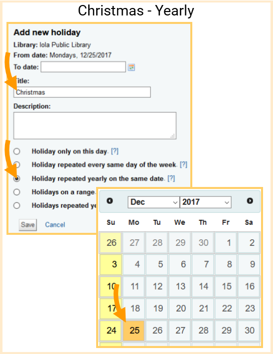
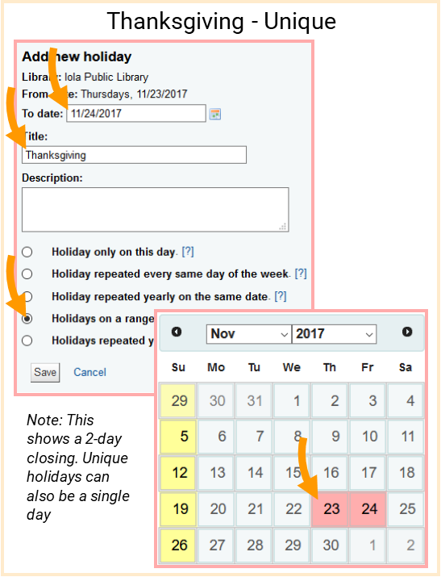
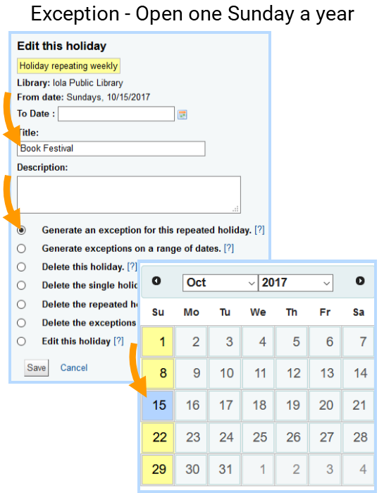

# Accessing the calendar

1. Click **More** then **Tools** on the top navigation bar

2. Click **Calendar** under **Additional tools**

# Adding holidays
1. Click the **date** you wish to modify

2. Fill in the form, then click **Save**

> **Reminders**
>
> * The calendar tells Koha when you will be closed. The affects due dates and fines calculations.
> * You can use the *To date* field to set a closing on a range of dates. This is handy for closings due to renovations or prolonged breaks.
> * There are 4 types of holidays:
>	* Unique: Holidays that move around each year (i.e. Thanksgiving)
>	* Weekly: Closings that happen on the same day each week (i.e. Sundays)
>	* Yearly: Closings that happen on the same date each year (i.e. Independence Day)
>	* Exception: Days where you're usually closed, but are open for some reason (i.e. always open on the last Sunday in October)

# Holiday Recipes

## Weekly

## Yearly

## Unique

## Exception
