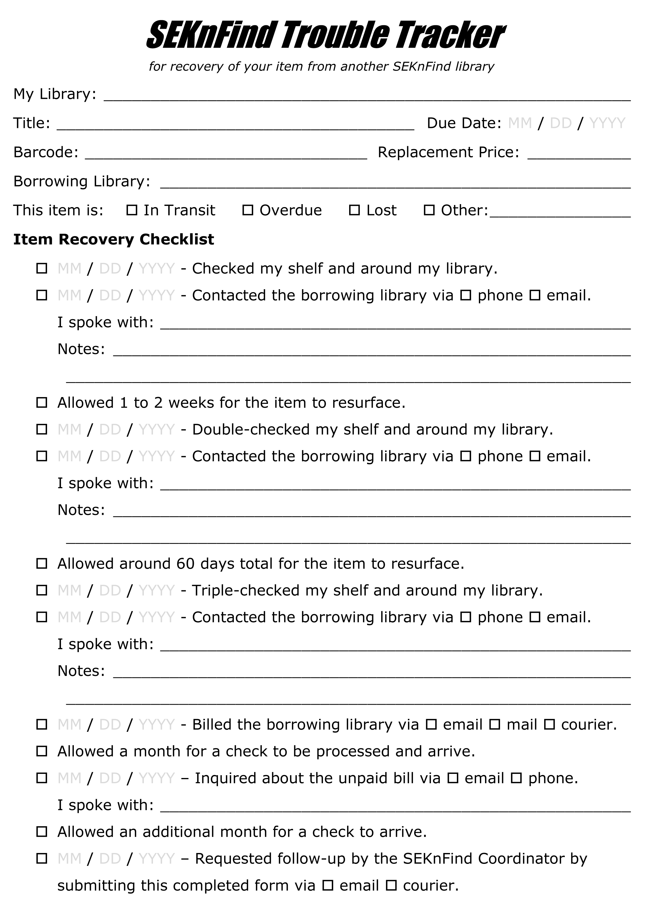

The trouble tracker was created to help keep track of communication between libraries regarding missing items.

Each item should be tracked on a separate sheet and maintained when steps are taken to retrieve an item.

Please include a copy of the completed trouble tracker when requesting follow-up on the situation from the SEKnFind Coordinator.

PDF copies of the tracker are available here:
- Google Drive: https://drive.google.com/open?id=1qHH0ZR_hbonPLEHwBkf2nXozBozD1Zqp
- Dropbox: https://www.dropbox.com/s/b80pagghss84mm3/SEKnFind%20Trouble%20Tracker.pdf?dl=0

