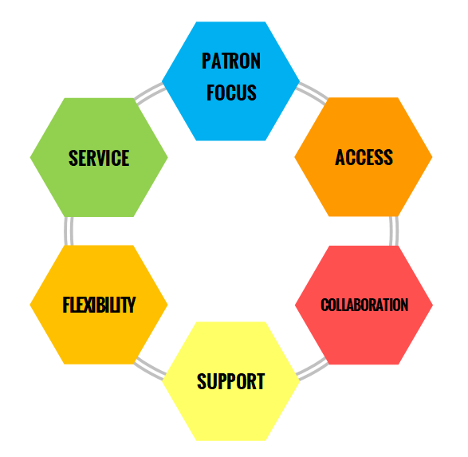

## Vision
The people of southeast Kansas have rapid, direct and open access to an enriched and comprehensive shared collection of library resources.

## Values
- **Service:**
	Administered by the Southeast Kansas Library System (SEKLS), SEKnFind is a patron-centered, high-quality, affordable and responsive regional catalog. 

- **Patron Focus:**
	Development of SEKnFind is based primarily on patron needs.

- **Access:**
	SEKnFind members provide open access to at least 95% of their general, circulating collection.  Access is available to all patrons of participating libraries.

- **Collaboration:**
	SEKnFind is a shared system with a shared patron database and shared responsibility for maintaining and expanding the system in a professional manner.
	SEKnFind is a rapidly evolving, member-driven system based upon collaboration and open sharing of expertise by all participating libraries.

- **Support:**
	SEKLS has made a long-term commitment to supporting SEKnFind as a primary system service.
	SEKLS staff have a primary role for ongoing training and support, with extensive contributions of time and knowledge by SEKnFind participants.
	
- **Flexibility:**
	Patron service standards dictate that some SEKnFind procedures will require standardization across the system, with local control remaining a guiding tenet of SEKLS.

## Responsibilities
- To share most materials, regardless of where the borrower is registered.
- To fill holds each day the library is open. 
- To maintain confidentiality of patron registration and borrowing information.
- To commit to making the database as clean as possible (no duplicate bibliographic records, standard cataloging practices, etc.)
- To abide by SEKnFind policies and prescribed procedures.
- To share information on SEKnFind problems, solutions and best practices.

*Approved 06/05/09*